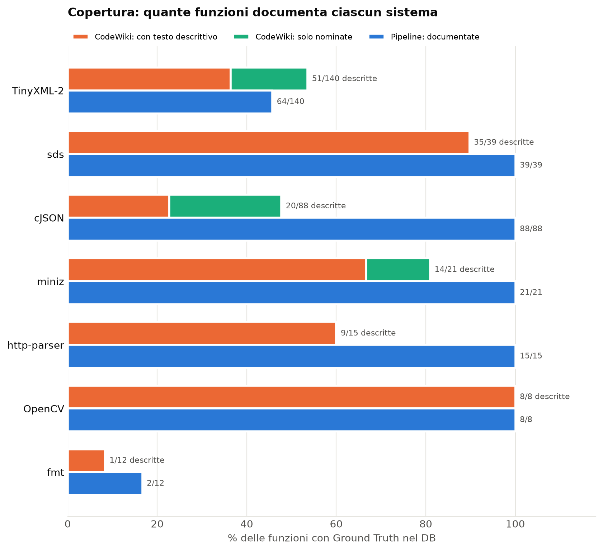
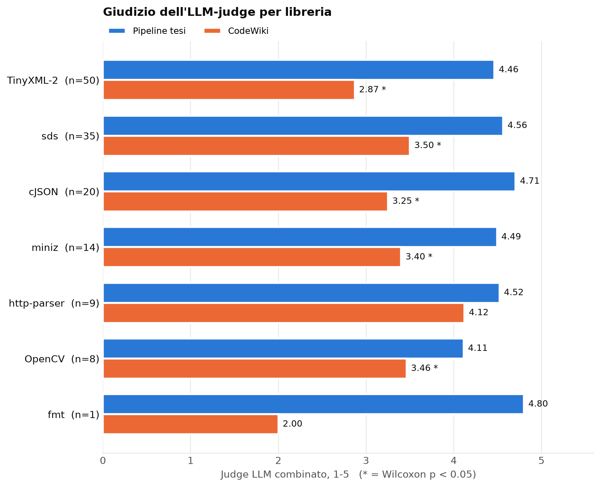
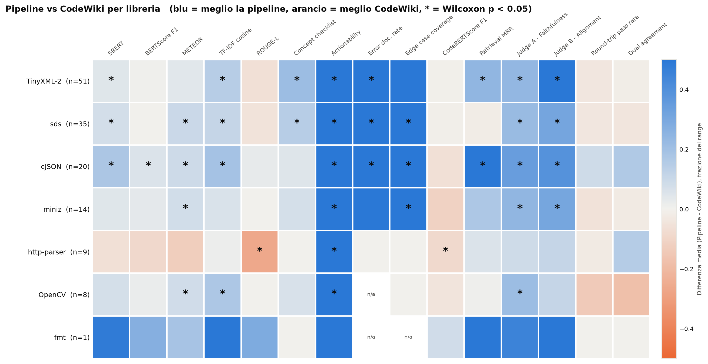
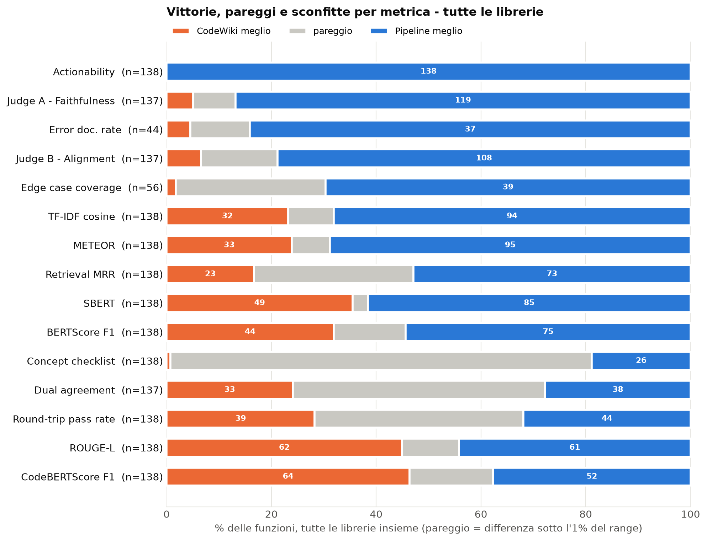
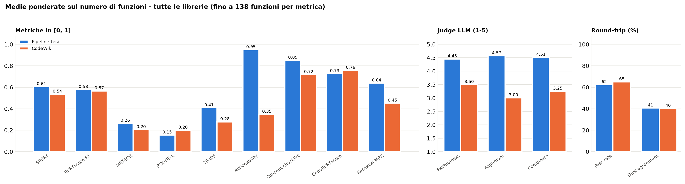

# Confronto CodeWiki vs pipeline della tesi - risultati complessivi

> 7 librerie, 138 funzioni confrontate in totale. Generato da `utils/plot_codewiki_overall.py` a partire dai riepiloghi di ogni libreria (`compare_CodeWiki/<Libreria>/`). Nessuna chiamata API.

## Copertura

| Libreria | Funzioni nel DB | CodeWiki: nominate | CodeWiki: con testo | Pipeline: documentate | In comune (confronto) |
|----------|-----------------|--------------------|---------------------|-----------------------|-----------------------|
| TinyXML-2 | 140 | 75 | 51 | 64 | 51 |
| sds | 39 | 35 | 35 | 39 | 35 |
| cJSON | 88 | 42 | 20 | 88 | 20 |
| miniz | 21 | 17 | 14 | 21 | 14 |
| http-parser | 15 | 9 | 9 | 15 | 9 |
| OpenCV | 8 | 8 | 8 | 8 | 8 |
| fmt | 12 | 1 | 1 | 2 | 1 |

Il confronto qualitativo si fa solo sulle funzioni che CodeWiki descrive con un testo e che hanno un Ground Truth. Le funzioni solo *nominate* (elenchi di nomi, diagrammi) contano nella copertura ma non hanno testo da valutare.

## Metriche chiave per libreria (Pipeline / CodeWiki)

Un asterisco indica una differenza significativa (Wilcoxon appaiato, p < 0.05; calcolato solo per n >= 6).

| Libreria | n | Judge (1-5) | SBERT | BERTScore | METEOR | Actionability | Retrieval MRR | CodeBERT | Round-trip % |
|----------|---|---|---|---|---|---|---|---|---|
| TinyXML-2 | 51 | 4.46 / 2.87* | 0.60 / 0.55* | 0.58 / 0.58 | 0.30 / 0.26 | 0.96 / 0.44* | 0.66 / 0.42* | 0.77 / 0.77 | 61.3 / 65.0 |
| sds | 35 | 4.56 / 3.50* | 0.70 / 0.63* | 0.60 / 0.59 | 0.26 / 0.16* | 0.96 / 0.32* | 0.47 / 0.49 | 0.75 / 0.76 | 46.7 / 50.4 |
| cJSON | 20 | 4.71 / 3.25* | 0.54 / 0.37* | 0.55 / 0.50* | 0.22 / 0.13* | 0.93 / 0.28* | 0.83 / 0.31* | 0.66 / 0.72 | 61.2 / 52.5 |
| miniz | 14 | 4.49 / 3.40* | 0.44 / 0.40 | 0.52 / 0.48 | 0.17 / 0.09* | 0.93 / 0.25* | 0.54 / 0.37 | 0.60 / 0.71 | 76.4 / 81.7 |
| http-parser | 9 | 4.52 / 4.12 | 0.64 / 0.69 | 0.59 / 0.68 | 0.29 / 0.42 | 0.97 / 0.34* | 0.93 / 0.87 | 0.75 / 0.83* | 87.7 / 90.3 |
| OpenCV | 8 | 4.11 / 3.46* | 0.62 / 0.54 | 0.62 / 0.60 | 0.29 / 0.21* | 0.91 / 0.28* | 0.57 / 0.56 | 0.71 / 0.76 | 83.4 / 97.5 |
| fmt | 1 | 4.80 / 2.00 | 0.73 / 0.25 | 0.60 / 0.34 | 0.22 / 0.03 | 0.85 / 0.25 | 1.00 / 0.20 | 0.77 / 0.68 | 100.0 / 100.0 |

## Medie ponderate su tutte le librerie

Media di ogni metrica pesata sul numero di funzioni di ciascuna libreria. E' una sintesi descrittiva: le librerie hanno dimensioni molto diverse (TinyXML-2 e sds pesano di piu').

| Metrica | n | Pipeline | CodeWiki |
|---------|---|----------|----------|
| SBERT | 138 | 0.605 | 0.535 |
| BERTScore F1 | 138 | 0.578 | 0.566 |
| METEOR | 138 | 0.264 | 0.205 |
| ROUGE-L | 138 | 0.154 | 0.200 |
| TF-IDF | 138 | 0.408 | 0.277 |
| Actionability | 138 | 0.949 | 0.348 |
| Concept checklist | 138 | 0.851 | 0.717 |
| CodeBERTScore | 138 | 0.726 | 0.758 |
| Retrieval MRR | 138 | 0.639 | 0.451 |
| Faithfulness | 137 | 4.454 | 3.499 |
| Alignment | 137 | 4.572 | 3.004 |
| Combinato | 137 | 4.513 | 3.251 |
| Pass rate | 138 | 62.4 | 65.0 |
| Dual agreement | 137 | 40.6 | 40.3 |

## Vittorie per metrica (tutte le funzioni di tutte le librerie)

| Metrica | n | Pipeline meglio | Pareggio | CodeWiki meglio |
|---------|---|-----------------|----------|-----------------|
| Actionability | 138 | 138 | 0 | 0 |
| Judge A - Faithfulness | 137 | 119 | 11 | 7 |
| Error doc. rate | 44 | 37 | 5 | 2 |
| Judge B - Alignment | 137 | 108 | 20 | 9 |
| Edge case coverage | 56 | 39 | 16 | 1 |
| METEOR | 138 | 95 | 10 | 33 |
| TF-IDF cosine | 138 | 94 | 12 | 32 |
| Retrieval MRR | 138 | 73 | 42 | 23 |
| SBERT | 138 | 85 | 4 | 49 |
| BERTScore F1 | 138 | 75 | 19 | 44 |
| Concept checklist | 138 | 26 | 111 | 1 |
| Dual agreement | 137 | 38 | 66 | 33 |
| Round-trip pass rate | 138 | 44 | 55 | 39 |
| ROUGE-L | 138 | 61 | 15 | 62 |
| CodeBERTScore F1 | 138 | 52 | 22 | 64 |

## Grafici

I grafici di dettaglio di ogni libreria (distribuzioni, confronto per funzione, round-trip, heatmap funzione x metrica) sono in `compare_CodeWiki/<Libreria>/charts/`.

## Note e limiti

- **Round-trip**: le suite di test sono generate dall'LLM a partire dalla documentazione e spesso falliscono anche sul codice reference; molti errori sono di ambiente (simboli mancanti nello scaffold). Va letto come indicatore debole, non come misura diretta della qualita' della documentazione.
- **Judge**: per alcune funzioni una o piu' chiamate del judge sono fallite (quota API) e i loro punteggi sono stati esclusi: `n` del judge puo' essere inferiore a quello delle altre metriche.
- **Campioni piccoli**: fmt ha una sola funzione in comune, OpenCV 8, http-parser 9; i test statistici su campioni cosi' piccoli hanno poca potenza.
- **Ground Truth ereditato da gruppo**: una parte delle funzioni di cJSON e TinyXML-2 ha come riferimento il commento condiviso da un gruppo di dichiarazioni piu' la nota `Variant:` (colonna `doc_origin = group` nel DB).

- Librerie senza confronto disponibile: overall, zlib.
