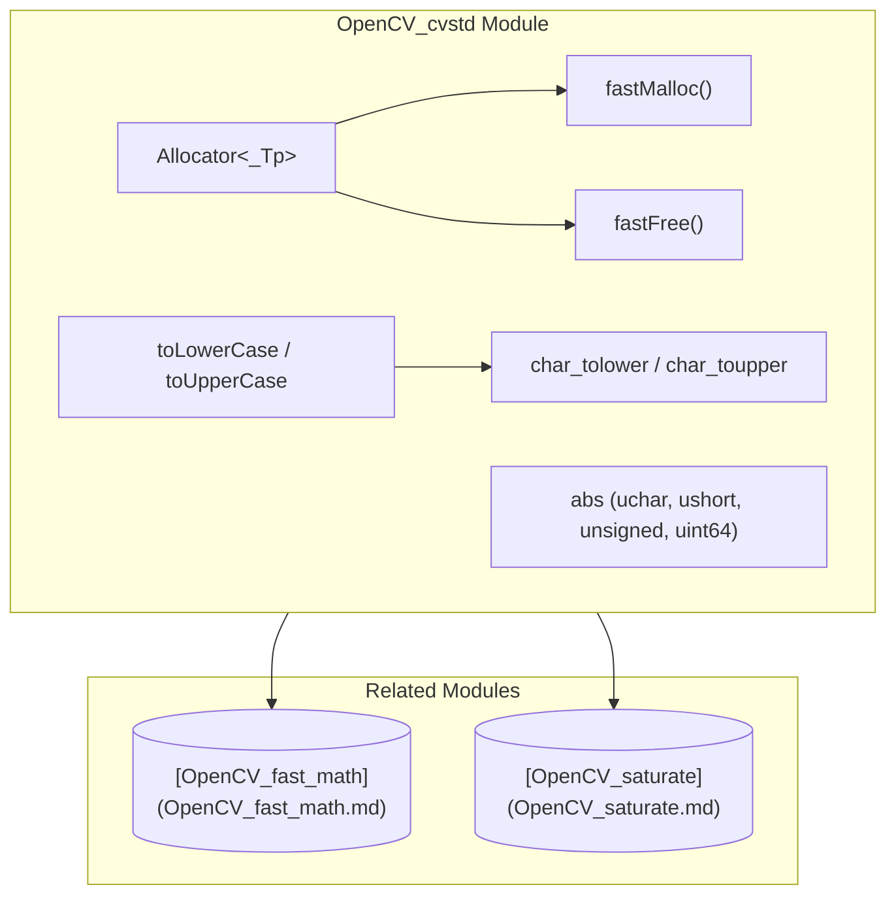
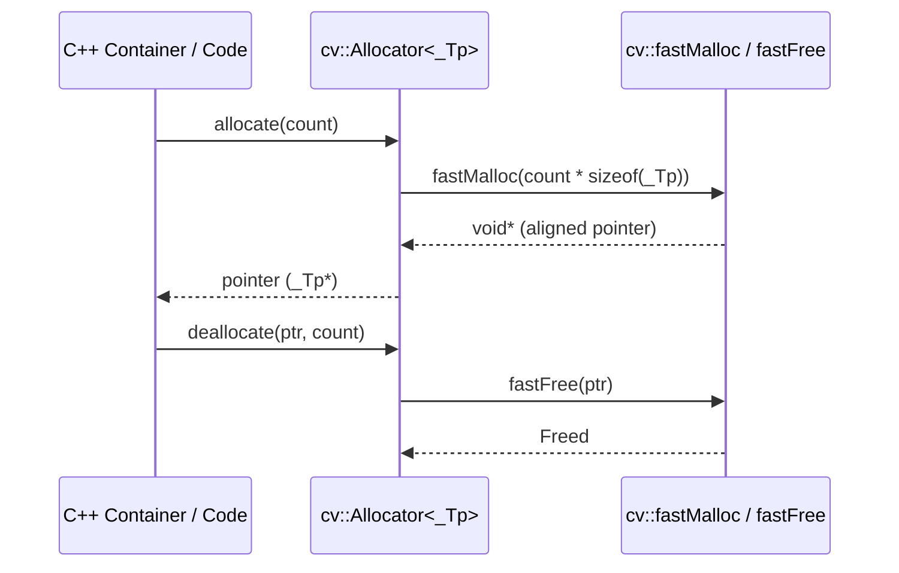

# OpenCV_cvstd Module Documentation

## Introduction

The **OpenCV_cvstd** module (`cvstd.hpp`) provides foundational standard library utilities, custom memory allocators, string manipulation wrappers, and mathematical helper functions for the OpenCV library. It bridges C++ standard library features with OpenCV's custom memory management and basic types.

---

## Core Components

### 1. Memory Management & `Allocator`
* **`fastMalloc` / `fastFree`**: Low-level functions that allocate and deallocate aligned memory buffers (aligned to 16 bytes when the buffer size is 16 bytes or more).
* **`Allocator<_Tp>`**: An STL-compliant memory allocator template built on top of `cv::fastMalloc()` and `cv::fastFree()`. It defines standard typedefs (`value_type`, `pointer`, `reference`, `size_type`, etc.), allocation/deallocation methods, object construction/destruction, and `rebind`.

### 2. Basic Utilities & Math Overloads
* **`abs` overloads**: Overloaded `abs` functions for unsigned types (`uchar`, `ushort`, `unsigned`, `uint64`), returning the value directly as required by generic programming and templates.
* **STL imports**: Imports essential utilities and mathematical functions into the `cv` namespace (`min`, `max`, `abs`, `swap`, `sqrt`, `exp`, `pow`, `log`).

### 3. String & Character Utilities
* **`String`**: Typedef for `std::string`.
* **`FileNode`**: Forward declaration for string constructors interacting with OpenCV's serialization structures.
* **Case Conversion**: 
  * `details::char_tolower` / `details::char_toupper`: Character-level case conversion wrappers around C standard library functions.
  * `toLowerCase` / `toUpperCase`: String-level transformation functions using `std::transform`.

---

## Architecture and Component Relationships

---

## Data Flow and Process

The following diagram illustrates how memory allocation via `Allocator` interacts with `fastMalloc`, and how string transformations utilize character conversion helpers:

---

## Relationship with Other Modules

* **[OpenCV_fast_math](OpenCV_fast_math.md)**: Frequently used alongside `cvstd` for fast mathematical operations (e.g., `cvFloor`, `cvRound`).
* **[OpenCV_saturate](OpenCV_saturate.md)**: Provides `saturate_cast` which works hand-in-hand with basic types and memory management utilities defined in core.
