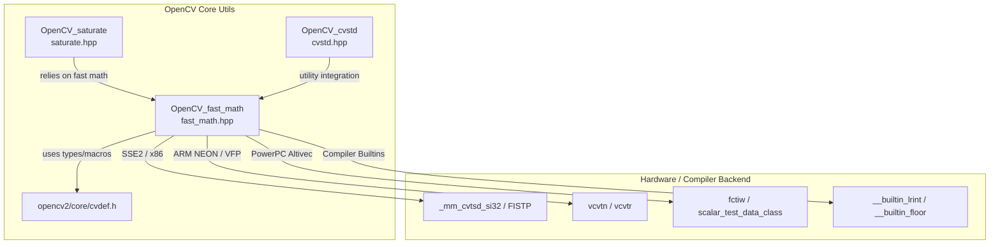
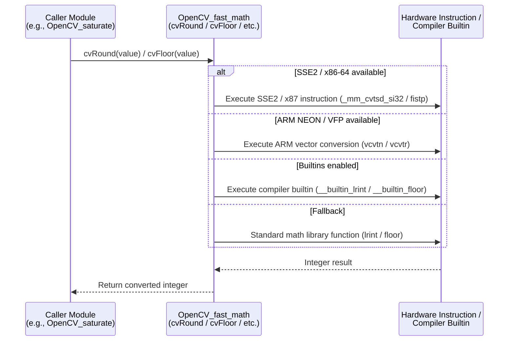

# OpenCV_fast_math Module Documentation

## Introduction

The `OpenCV_fast_math` module provides high-performance, cross-platform mathematical utility functions optimized for image processing and computer vision workloads. Located in `fast_math.hpp` under the `core_utils` group, this module defines inline functions for rounding, flooring, ceiling, and checking special floating-point values (`NaN` and infinity) for both `float` and `double` types (as well as integer identity overloads). 

By leveraging compiler builtins (`__builtin_lrint`, `__builtin_floor`, etc.), inline assembly (ARM VFP/NEON, PowerPC Altivec/Power8/Power9, LoongArch), and hardware-specific instructions (such as SSE2/x86 FISTP and ARM64 Neon intrinsics), `OpenCV_fast_math` bypasses standard library overhead to accelerate core mathematical operations.

---

## Architecture and Component Relationships

The module interfaces with core definitions from OpenCV (`opencv2/core/cvdef.h`, which provides types like `Cv32suf` and `Cv64suf`), and integrates closely with other foundational modules such as [OpenCV_saturate](OpenCV_saturate.md) for safe numeric casting and [OpenCV_cvstd](OpenCV_cvstd.md) for container and standard utility support.

---

## Core Components

The `fast_math.hpp` header defines the following inline functions:

### 1. `cvRound`
- **Purpose**: Rounds a floating-point number (`float` or `double`) to the nearest integer.
- **Behavior**: Utilizes hardware instructions (e.g., SSE2 `_mm_cvtsd_si32`, ARM Neon `vcvtn`, x87 `fistp`) or compiler builtins (`__builtin_lrint`) when available, falling back to standard `lrint` implementation. Overloaded for `int` to return the value directly.

### 2. `cvFloor`
- **Purpose**: Rounds a floating-point number to the nearest integer not larger than the original ($\lfloor \text{value} \rfloor$).
- **Behavior**: Leverages compiler builtins (`__builtin_floor`), ARM64/LoongArch specific instructions, or inline fallback arithmetic. Overloaded for `int`.

### 3. `cvCeil`
- **Purpose**: Rounds a floating-point number to the nearest integer not smaller than the original ($\lceil \text{value} \rceil$).
- **Behavior**: Uses compiler builtins (`__builtin_ceil`), ARM64/LoongArch instructions, or fallback arithmetic. Overloaded for `int`.

### 4. `cvIsNaN`
- **Purpose**: Determines if a floating-point number is "Not a Number" (IEEE 754 standard).
- **Behavior**: Checks bit representation via `Cv32suf` / `Cv64suf` unions or optimized compiler builtins (`__builtin_isnan`).

### 5. `cvIsInf`
- **Purpose**: Determines if a floating-point number represents positive or negative infinity (IEEE 754 standard).
- **Behavior**: Evaluates IEEE 754 bit patterns or uses compiler builtins (`__builtin_isinf`).

---

## Data Flow and Execution Process

When a client module (such as [OpenCV_saturate](OpenCV_saturate.md) or image filtering routines) performs mathematical operations or conversions, it invokes fast math wrappers. Depending on the target architecture detected at compile time, the optimal code path is selected:

---

## Integration with Other Modules

- **[OpenCV_saturate](OpenCV_saturate.md)**: Frequently pairs `saturate_cast` with fast rounding and flooring operations from this module to ensure safe and accelerated casting between numeric types.
- **[OpenCV_cvstd](OpenCV_cvstd.md)**: Shares core definitions and utility conventions across OpenCV's core infrastructure.
