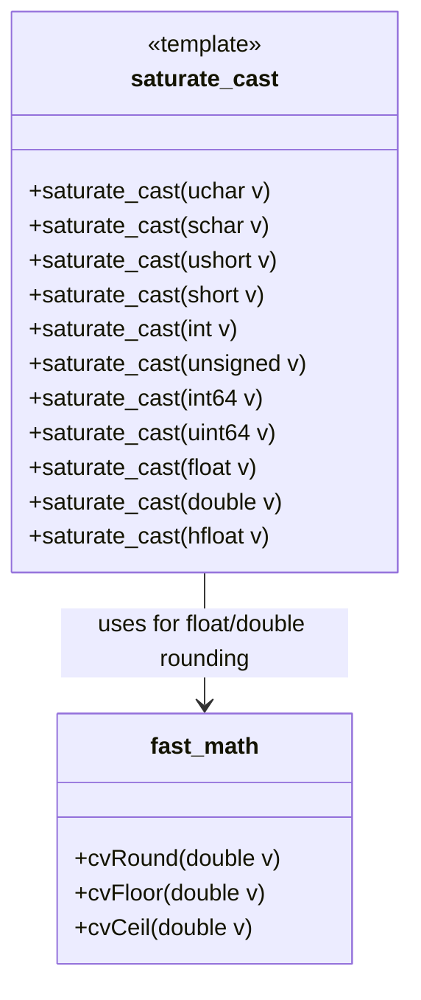
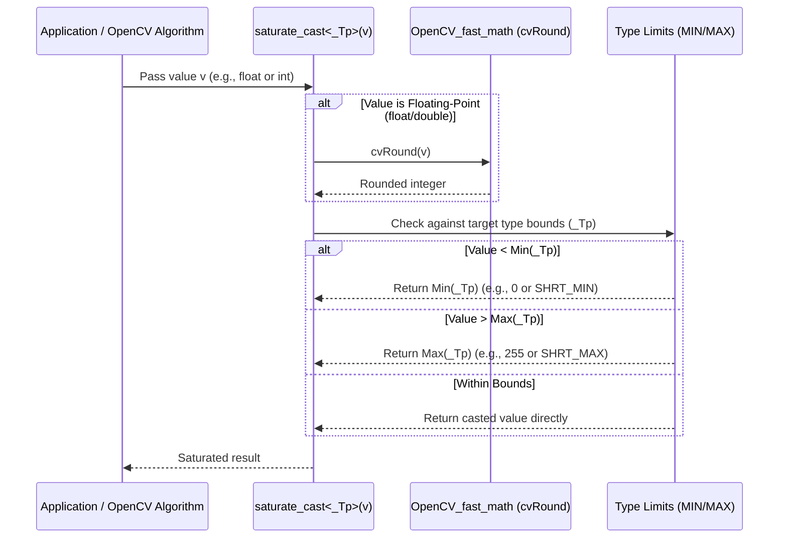

# OpenCV_saturate Module Documentation

## 1. Introduction and Purpose

The `OpenCV_saturate` module provides safe, efficient, and precise type casting functions—specifically the `saturate_cast` template function family—tailored for image and signal processing within OpenCV. 

In computer vision and image processing, arithmetic operations frequently result in values exceeding the valid range of standard primitive types (e.g., pixel values going below `0` or above `255` for 8-bit grayscale images). Standard C++ casting (`static_cast`, C-style casts) truncates overflow/underflow bits, leading to severe visual artifacts. `saturate_cast` solves this by clipping (saturating) out-of-bound values to the target type's minimum or maximum representable bounds.

---

## 2. Architecture and Core Components

The module centers around `saturate.hpp`, which implements general templates and specialized template instantiations for various primitive numeric types (`uchar`, `schar`, `ushort`, `short`, `int`, `unsigned`, `int64`, `uint64`, `float`, `double`, and `hfloat`).

### Core Component: `saturate_cast`

- **Purpose**: Converts a value from one primitive type to another while clipping out-of-range values instead of wrapping around.
- **Floating-point Handling**: When converting from floating-point types (`float`, `double`) to integer types, values are first rounded to the nearest integer using [OpenCV_fast_math](OpenCV_fast_math.md) utilities (`cvRound`), then clipped if necessary.

---

## 3. Data Flow and Process Flow

When an arithmetic or conversion operation invokes `saturate_cast`, the execution follows a robust path ensuring type safety and correct numerical clipping:

---

## 4. Relationship with Other Modules

- **[OpenCV_fast_math](OpenCV_fast_math.md)**: `saturate.hpp` includes `opencv2/core/fast_math.hpp` to utilize fast rounding functions like `cvRound` when converting floating-point values to integer types.
- **[OpenCV_cvstd](OpenCV_cvstd.md)**: Works alongside standard utilities and containers within OpenCV's core infrastructure.
- **Image & Signal Processing Operations**: Used extensively across core and imgproc modules (such as `add`, `subtract`, `multiply`, `divide`, and `Mat::convertTo`) to handle pixel value boundaries correctly.
