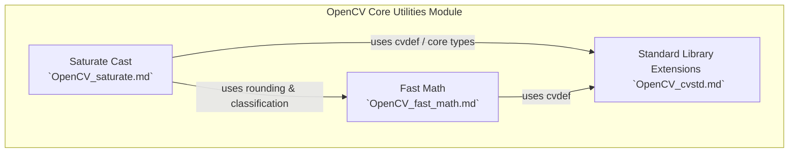
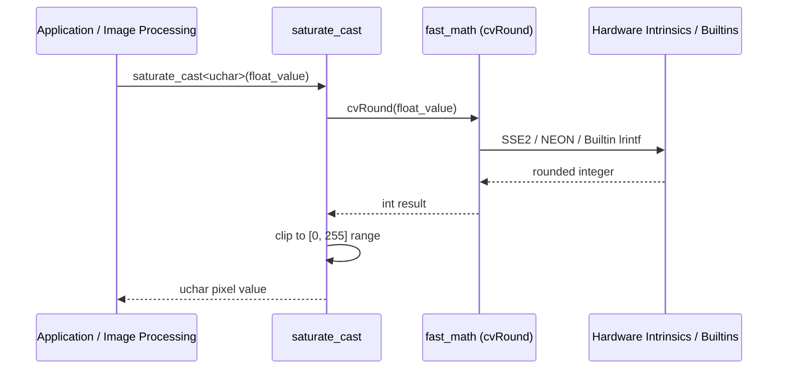

# OpenCV Core Utilities Module

## Overview

The OpenCV core utilities module (`OpenCV`) provides foundational math operations, safe type casting, memory management primitives, and standard library extensions (`cv::String`, memory allocators) required across the entire Open Source Computer Vision Library. These utilities are optimized for cross-platform performance, utilizing hardware-specific instructions (such as SSE2, NEON, Altivec, and compiler builtins) where available.

## Architecture Overview

The module consists of three primary sub-modules:
1. **Fast Math (`OpenCV_fast_math`)**: High-performance mathematical rounding (`cvRound`, `cvFloor`, `cvCeil`) and IEEE 754 floating-point classification (`cvIsNaN`, `cvIsInf`).
2. **Saturate Cast (`OpenCV_saturate`)**: Safe and efficient primitive type conversion with value clipping (`saturate_cast`) for image and signal processing.
3. **C++ Standard Library Extensions (`OpenCV_cvstd`)**: Custom STL memory allocators (`cv::Allocator`) wrapping aligned memory routines (`fastMalloc`, `fastFree`), string manipulation helpers (`toLowerCase`, `toUpperCase`), and STL algorithm/math imports.

---

## Sub-Modules Summary

### 1. Fast Math (`OpenCV_fast_math`)
- **Purpose**: Provides optimized scalar operations for rounding floating-point numbers to integers and checking for special IEEE 754 floating-point values (NaN and Infinity).
- **Key Functions**:
  - `cvRound`: Rounds a floating-point number to the nearest integer.
  - `cvFloor`: Rounds down to the nearest integer not larger than the value.
  - `cvCeil`: Rounds up to the nearest integer not smaller than the value.
  - `cvIsNaN`: Checks if a value is Not-a-Number.
  - `cvIsInf`: Checks if a value is positive or negative infinity.
- **Reference**: See [OpenCV_fast_math.md](OpenCV_fast_math.md) for detailed documentation and implementation specifics.

### 2. Saturate Cast (`OpenCV_saturate`)
- **Purpose**: Implements accurate and efficient primitive type casting with clipping (`saturate_cast`), preventing overflow/underflow artifacts during image and signal processing operations (e.g. `Mat::convertTo`).
- **Key Functions**:
  - `saturate_cast<_Tp>`: Template function specialized across various integer, floating-point, and half-precision (`hfloat`) types.
- **Reference**: See [OpenCV_saturate.md](OpenCV_saturate.md) for detailed documentation and specialization matrices.

### 3. C++ Standard Library Extensions (`OpenCV_cvstd`)
- **Purpose**: Bridges standard library containers and algorithms with OpenCV's memory management and utility conventions.
- **Key Components**:
  - `cv::Allocator`: STL-compliant allocator utilizing `fastMalloc` and `fastFree`.
  - `fastMalloc` / `fastFree`: Aligned memory buffer allocation (16-byte alignment when size $\ge$ 16 bytes).
  - String utilities: `toLowerCase`, `toUpperCase`, and character conversion helpers.
- **Reference**: See [OpenCV_cvstd.md](OpenCV_cvstd.md) for detailed documentation.

---

## Component Interaction & Data Flow

When processing image pixel conversions (e.g., converting floating-point filter outputs to `uchar` display images), the components interact as follows:

