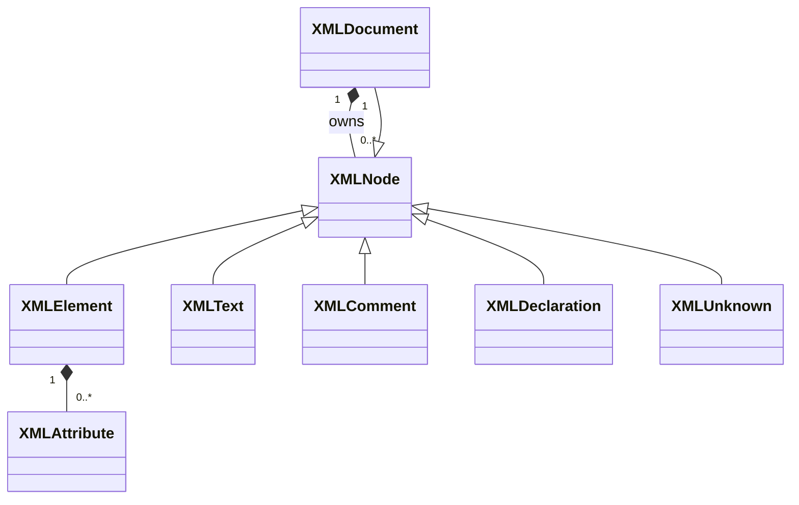
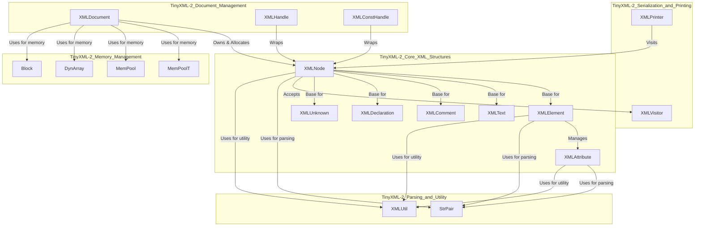

# TinyXML-2 Core XML Structures

## Introduction

The `TinyXML-2_Core_XML_Structures` module is the foundational component of the TinyXML-2 library, defining the essential building blocks for representing an XML document in memory. It provides a set of classes that correspond to the various constructs found in an XML document, such as elements, attributes, text nodes, comments, declarations, and unknown tags. All these core structures, except for attributes, are derived from a common base class, `XMLNode`, establishing a hierarchical Document Object Model (DOM) that can be navigated and manipulated.

This module is central to how TinyXML-2 parses, stores, and allows interaction with XML data, forming the in-memory representation that other modules, such as parsing, serialization, and document management, operate upon.

## Core XML Structures

This section details the primary classes within the `TinyXML-2_Core_XML_Structures` module, outlining their purpose, key functionalities, and relationships.

### `XMLNode`

The `XMLNode` class serves as the abstract base class for all node types in the TinyXML-2 DOM tree, with the exception of `XMLAttribute`. It provides the fundamental interface for navigating the XML hierarchy and managing common node properties.

*   **Purpose**: To provide a common interface and base functionality for all XML node types, enabling hierarchical navigation and generic operations.
*   **Key Methods and Properties**:
    *   `GetDocument()`: Returns a pointer to the `XMLDocument` that owns this node.
    *   `Value()`, `SetValue()`: Access and modify the string value associated with the node (e.g., element name, comment text).
    *   `Parent()`, `FirstChild()`, `LastChild()`, `NextSibling()`, `PreviousSibling()`: Methods for traversing the DOM tree.
    *   `FirstChildElement()`, `LastChildElement()`, `NextSiblingElement()`, `PreviousSiblingElement()`: Convenience methods for navigating to specific child or sibling elements, optionally by name.
    *   `InsertEndChild()`, `InsertFirstChild()`, `InsertAfterChild()`: Methods for adding child nodes to the current node.
    *   `DeleteChildren()`, `DeleteChild()`: Methods for removing child nodes.
    *   `ShallowClone()`, `DeepClone()`: Create copies of the node, either just the node itself or the node and all its children.
    *   `ShallowEqual()`: Compares two nodes for equality without comparing their children.
    *   `Accept(XMLVisitor*)`: Implements the Visitor pattern, allowing external `XMLVisitor` objects to traverse and process the node and its children.
*   **Relationships**:
    *   It is the direct base class for `XMLElement`, `XMLText`, `XMLComment`, `XMLDeclaration`, and `XMLUnknown`.
    *   Every `XMLNode` instance is owned by an `XMLDocument` (see [TinyXML-2_Document_Management.md](TinyXML-2_Document_Management.md)).
    *   It interacts with `XMLVisitor` (from [TinyXML-2_Serialization_and_Printing.md](TinyXML-2_Serialization_and_Printing.md)) for tree traversal.

### `XMLElement`

The `XMLElement` class represents an XML element, which is the most common and fundamental construct in an XML document. Elements can have a name, attributes, and can contain other nodes (elements, text, comments, unknowns) as children.

*   **Purpose**: To represent an XML element, providing mechanisms to access its name, attributes, and child nodes.
*   **Key Methods and Properties**:
    *   `Name()`, `SetName()`: Access and modify the name of the element.
    *   `Attribute()`, `IntAttribute()`, `UnsignedAttribute()`, `BoolAttribute()`, `DoubleAttribute()`, `FloatAttribute()`: Retrieve the value of an attribute by name, with various type conversions.
    *   `QueryIntAttribute()`, `QueryUnsignedAttribute()`, etc.: Safely query attribute values with error checking.
    *   `SetAttribute()`: Set the value of an attribute, creating it if it doesn't exist. Overloaded for various data types.
    *   `DeleteAttribute()`: Remove an attribute by name.
    *   `FirstAttribute()`, `FindAttribute()`: Access attributes directly.
    *   `GetText()`, `SetText()`: Convenience methods for accessing and setting the text content of a simple element.
    *   `QueryIntText()`, `QueryUnsignedText()`, etc.: Safely query the text content of a child text node with error checking.
    *   `InsertNewChildElement()`, `InsertNewComment()`, `InsertNewText()`, `InsertNewDeclaration()`, `InsertNewUnknown()`: Convenience methods for creating and inserting new child nodes.
*   **Relationships**:
    *   Inherits from `XMLNode`.
    *   Manages a list of `XMLAttribute` objects.
    *   Can contain any `XMLNode` derived type as a child.

### `XMLAttribute`

The `XMLAttribute` class represents an attribute associated with an `XMLElement`. Attributes are name-value pairs and are not part of the `XMLNode` hierarchy; they are managed directly by their parent `XMLElement`.

*   **Purpose**: To store a name-value pair that modifies the properties of an `XMLElement`.
*   **Key Methods and Properties**:
    *   `Name()`: Returns the name of the attribute.
    *   `Value()`: Returns the string value of the attribute.
    *   `GetLineNum()`: Returns the line number where the attribute was parsed.
    *   `Next()`: Returns the next attribute in the `XMLElement`'s attribute list.
    *   `IntValue()`, `UnsignedValue()`, `BoolValue()`, `DoubleValue()`, `FloatValue()`: Interpret the attribute's value as a specific primitive type.
    *   `QueryIntValue()`, `QueryUnsignedValue()`, etc.: Safely query attribute values with error checking.
    *   `SetAttribute()`: Set the attribute's value. Overloaded for various data types.
*   **Relationships**:
    *   Associated with, and managed by, an `XMLElement`.

### `XMLText`

The `XMLText` class represents the textual content within an XML element. It can be either standard text or CDATA (Character Data).

*   **Purpose**: To hold the character data content of an XML element.
*   **Key Methods and Properties**:
    *   `SetCData()`: Sets whether the text should be treated as CDATA.
    *   `CData()`: Returns `true` if the text is CDATA.
*   **Relationships**:
    *   Inherits from `XMLNode`.
    *   Typically a child of an `XMLElement`.

### `XMLComment`

The `XMLComment` class represents an XML comment (`<!-- comment content -->`).

*   **Purpose**: To store and represent comments within the XML document.
*   **Key Methods and Properties**: Inherits `Value()` and `SetValue()` from `XMLNode` to access and modify the comment text.
*   **Relationships**:
    *   Inherits from `XMLNode`.
    *   Can be a child of an `XMLDocument` or an `XMLElement`.

### `XMLDeclaration`

The `XMLDeclaration` class represents the XML declaration (`<?xml version="1.0" encoding="UTF-8"?>`).

*   **Purpose**: To represent the XML declaration at the beginning of an XML document.
*   **Key Methods and Properties**: Inherits `Value()` and `SetValue()` from `XMLNode` to access and modify the declaration text.
*   **Relationships**:
    *   Inherits from `XMLNode`.
    *   Typically the first child of an `XMLDocument`.

### `XMLUnknown`

The `XMLUnknown` class is a catch-all for any XML tag that TinyXML-2 does not explicitly recognize or parse into a specific node type, such as DTD (Document Type Definition) tags. The content of an unknown tag is preserved as a raw string.

*   **Purpose**: To store unrecognized XML constructs, preserving their original text content.
*   **Key Methods and Properties**: Inherits `Value()` and `SetValue()` from `XMLNode` to access and modify the unknown tag's content.
*   **Relationships**:
    *   Inherits from `XMLNode`.
    *   Can be a child of an `XMLDocument` or an `XMLElement`.

## Module Architecture

### Class Hierarchy

The following diagram illustrates the inheritance hierarchy of the core XML structures:

### Component Interaction

This diagram shows how the core XML structures interact with each other and with components from other TinyXML-2 modules.

## Integration with TinyXML-2

The `TinyXML-2_Core_XML_Structures` module is fundamental to the entire TinyXML-2 library, providing the in-memory representation of XML data. Its integration with other modules is crucial for the library's functionality.

### Ownership and Memory Management

All instances of `XMLNode` derived classes (like `XMLElement`, `XMLText`, `XMLComment`, `XMLDeclaration`, `XMLUnknown`) and `XMLAttribute` objects are intrinsically linked to and owned by an `XMLDocument` instance (defined in [TinyXML-2_Document_Management.md](TinyXML-2_Document_Management.md)). This ownership model simplifies memory management significantly:

*   When an `XMLDocument` object is created, it initializes internal memory pools.
*   All nodes and attributes created through the `XMLDocument` (e.g., `NewElement()`, `NewAttribute()`) are allocated from these pools.
*   Upon the destruction of an `XMLDocument`, all associated nodes and attributes are automatically deallocated, preventing memory leaks.
*   This efficient memory management is handled by the `MemPoolT` and `MemPool` classes (from [TinyXML-2_Memory_Management.md](TinyXML-2_Memory_Management.md)), which pre-allocate blocks of memory for objects of specific sizes, reducing the overhead of frequent `new` and `delete` calls.

### DOM Traversal and Serialization

The `XMLNode::Accept(XMLVisitor*)` method is a cornerstone of the module's extensibility, implementing the [Visitor pattern](https://en.wikipedia.org/wiki/Visitor_pattern). This pattern allows for operations to be performed on the XML DOM tree without modifying the structure classes themselves.

*   The `XMLVisitor` class (from [TinyXML-2_Serialization_and_Printing.md](TinyXML-2_Serialization_and_Printing.md)) defines a set of virtual methods (e.g., `VisitEnter()`, `VisitExit()`, `Visit()`) for each specific node type.
*   By implementing a custom `XMLVisitor`, developers can define their own logic to be executed when traversing the XML tree, enabling tasks such as:
    *   **Serialization**: The `XMLPrinter` class (also from [TinyXML-2_Serialization_and_Printing.md](TinyXML-2_Serialization_and_Printing.md)) is a concrete implementation of `XMLVisitor` that serializes the DOM back into an XML string or file.
    *   **Validation**: Checking the structure or content of the XML against specific rules.
    *   **Transformation**: Modifying the XML structure or content based on certain criteria.
    *   **Searching**: Finding specific nodes or data within the document.

### Parsing and Utility Functions

The core XML structures rely heavily on utility components during the parsing process and for general string manipulation:

*   **`StrPair`**: This class (from [TinyXML-2_Parsing_and_Utility.md](TinyXML-2_Parsing_and_Utility.md)) is used internally by `XMLNode` and `XMLAttribute` to manage string data efficiently. During parsing, `StrPair` often points directly into the raw XML buffer, minimizing memory allocations and copies. It also handles XML entity processing (e.g., `&amp;`, `&lt;`) and whitespace normalization.
*   **`XMLUtil`**: This static utility class (from [TinyXML-2_Parsing_and_Utility.md](TinyXML-2_Parsing_and_Utility.md)) provides a collection of helper functions essential for parsing and data conversion. These include:
    *   Character classification (e.g., `IsWhiteSpace()`, `IsNameStartChar()`).
    *   String comparison (`StringEqual()`).
    *   Conversion between string representations and primitive data types (e.g., `ToInt()`, `ToStr()`), which are vital for handling attribute and text values.

### Document Handles

The `XMLHandle` and `XMLConstHandle` classes (from [TinyXML-2_Document_Management.md](TinyXML-2_Document_Management.md)) provide a convenient and safe way to navigate the XML DOM tree by wrapping `XMLNode` pointers with null checks. This significantly reduces the boilerplate code required for checking null pointers at each step of a traversal, making code more concise and robust when working with the core XML structures.
