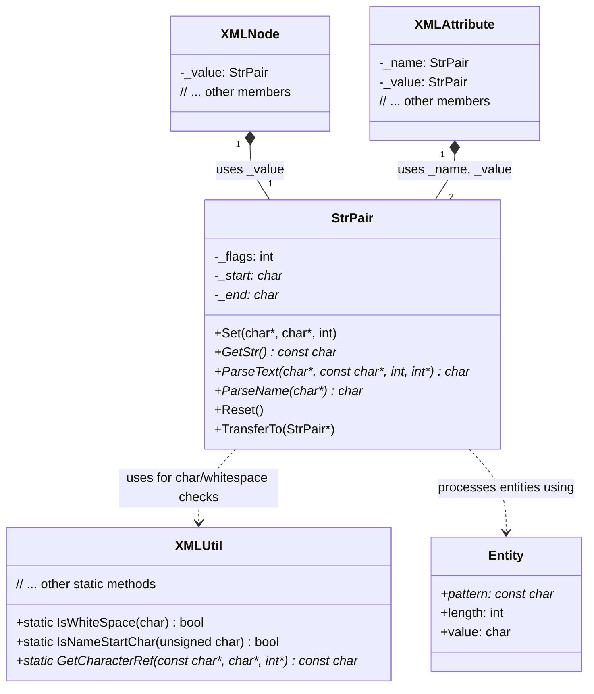
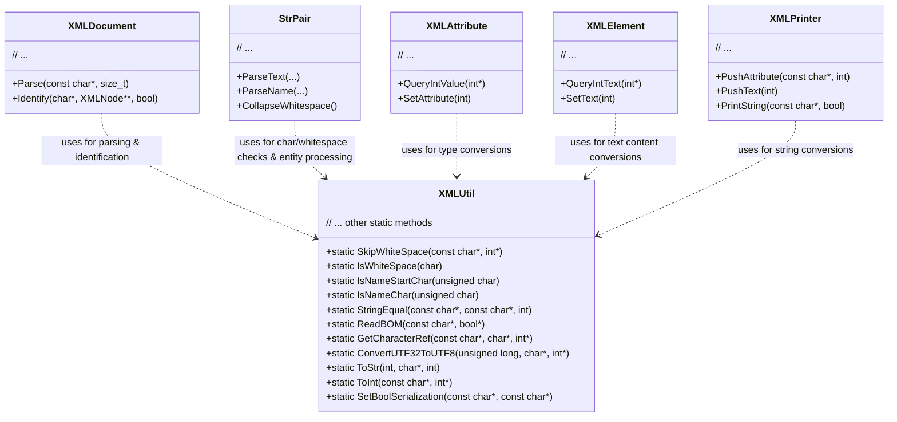
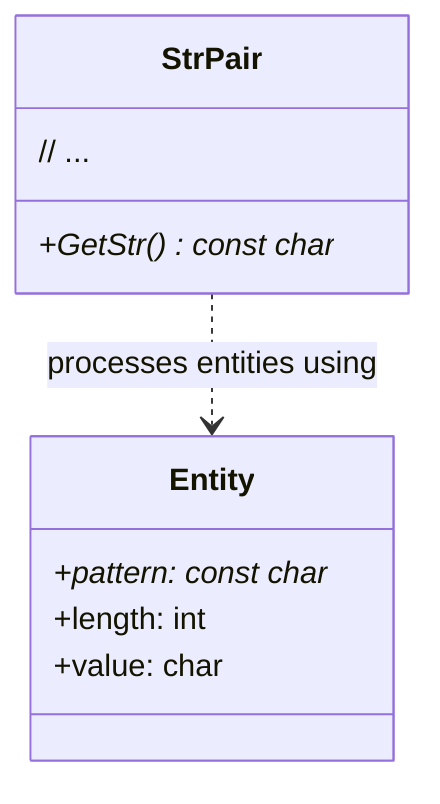

# TinyXML-2_Parsing_and_Utility Module Documentation

## Introduction

The `TinyXML-2_Parsing_and_Utility` module is a fundamental part of the TinyXML-2 library, providing essential functionalities for parsing XML data and offering a suite of utility functions for string manipulation and type conversions. It acts as a bridge between raw character data and structured XML components, ensuring correct interpretation and efficient handling of XML content.

This module is crucial for:
*   Efficiently parsing XML text, including handling entities and whitespace.
*   Converting string representations of data to various primitive types and vice-versa.
*   Providing core utilities for character and string operations used throughout the TinyXML-2 library.

## Architecture and Component Relationships

The `TinyXML-2_Parsing_and_Utility` module primarily consists of two key classes: `StrPair` and `XMLUtil`, along with the `Entity` struct. These components work in conjunction with other modules, particularly those defining core XML structures and document management, to provide a robust XML parsing and manipulation framework.

### StrPair

The `StrPair` class is designed to efficiently manage string data within the TinyXML-2 library. It can store either pointers to a segment of the original XML file (for read-only access) or manage its own allocated `char[]` for mutable strings. A key feature of `StrPair` is its ability to perform normalization and entity translation when the string content is accessed via `GetStr()`.

#### Core Functionality:
*   **String Storage:** Stores a `_start` and `_end` pointer to a character array, or manages its own dynamically allocated memory.
*   **Content Processing:** Supports entity processing, newline normalization, and whitespace collapsing based on specified flags.
*   **Parsing:** Provides methods to parse text content and XML names from a character stream.
*   **Memory Management:** Can own and delete its allocated memory if `NEEDS_DELETE` flag is set.

#### Relationships:
`StrPair` is a core building block for storing string values in various XML nodes and attributes.
*   **[XMLNode](TinyXML-2_Core_XML_Structures.md):** The `_value` member of `XMLNode` (and its derived classes like `XMLElement`, `XMLText`, `XMLComment`, `XMLDeclaration`, `XMLUnknown`) is an instance of `StrPair`, used to store the node's textual content (e.g., element name, comment text, text node value).
*   **[XMLAttribute](TinyXML-2_Core_XML_Structures.md):** Both the `_name` and `_value` members of `XMLAttribute` are `StrPair` instances, storing the attribute's name and its corresponding value.
*   **XMLUtil:** `StrPair` utilizes `XMLUtil` for character and whitespace checking during its parsing operations.
*   **Entity:** `StrPair` uses the `Entity` struct (defined in `tinyxml2.cpp`) to perform entity translation when `NEEDS_ENTITY_PROCESSING` is enabled.

### XMLUtil

The `XMLUtil` class provides a collection of static utility functions that are widely used across the TinyXML-2 library for various low-level operations. These functions are essential for parsing, string manipulation, and converting between string representations and primitive data types.

#### Core Functionality:
*   **Whitespace Handling:** Functions like `SkipWhiteSpace` and `IsWhiteSpace` are used to navigate and identify whitespace characters in XML content.
*   **Name Validation:** `IsNameStartChar` and `IsNameChar` help validate characters used in XML element and attribute names.
*   **String Comparison:** `StringEqual` provides a safe way to compare character strings.
*   **UTF-8 Handling:** `IsUTF8Continuation`, `ReadBOM`, `GetCharacterRef`, and `ConvertUTF32ToUTF8` facilitate the correct handling of UTF-8 encoded XML.
*   **Type Conversions:** A comprehensive set of `ToStr` (e.g., `ToStr(int, char*, int)`) and `To` (e.g., `ToInt(const char*, int*)`) functions enable conversion between primitive data types (int, unsigned, bool, float, double, int64_t, uint64_t) and their string representations.
*   **Boolean Serialization:** `SetBoolSerialization` allows customization of how boolean values are serialized to strings.

#### Relationships:
`XMLUtil` is a central utility class, with its static methods being invoked by numerous other classes in the library.
*   **[XMLDocument](TinyXML-2_Document_Management.md):** Uses `XMLUtil` for skipping whitespace, reading BOM, and identifying node types during the parsing process.
*   **StrPair:** Relies on `XMLUtil` for character classification and entity processing.
*   **[XMLAttribute](TinyXML-2_Core_XML_Structures.md):** Uses `XMLUtil` extensively for converting attribute values to and from primitive data types.
*   **[XMLElement](TinyXML-2_Core_XML_Structures.md):** Employs `XMLUtil` for converting text content within elements to and from primitive data types.
*   **[XMLPrinter](TinyXML-2_Serialization_and_Printing.md):** Utilizes `XMLUtil` for converting primitive types to strings when printing XML.

### Entity (struct)

The `Entity` struct is a simple data structure defined in `tinyxml2.cpp` that holds information about predefined XML entities. These entities are special character sequences (e.g., `&amp;` for `&`) that need to be translated during XML parsing and serialization.

#### Structure:
*   `pattern`: The string representation of the entity (e.g., "quot").
*   `length`: The length of the `pattern` string.
*   `value`: The actual character value the entity represents (e.g., `DOUBLE_QUOTE`).

#### Relationships:
*   **StrPair:** The `StrPair::GetStr()` method uses a static array of `Entity` structs to perform entity translation when the `NEEDS_ENTITY_PROCESSING` flag is set. This ensures that XML entities are correctly converted to their corresponding characters when the string content is retrieved.

## How the Module Fits into the Overall System

The `TinyXML-2_Parsing_and_Utility` module is a foundational layer within the TinyXML-2 library. It provides the essential tools for handling the raw textual data of an XML document and converting it into a usable format for the higher-level XML structures.

*   **Parsing XML:** The `StrPair` class, in conjunction with `XMLUtil`, is directly responsible for the low-level parsing of XML elements, attributes, and text content. It handles the intricacies of whitespace, character entities, and different parsing modes (e.g., CDATA).
*   **Data Conversion:** `XMLUtil`'s extensive set of `ToStr` and `To` functions are critical for converting the string-based data found in XML attributes and text nodes into native C++ primitive types, and vice-versa when modifying or creating XML programmatically. This allows developers to work with XML data in a type-safe and convenient manner.
*   **Foundation for Core XML Structures:** The `StrPair` instances are embedded within the [TinyXML-2_Core_XML_Structures](TinyXML-2_Core_XML_Structures.md) module's classes (like `XMLNode` and `XMLAttribute`) to store their names and values. Without `StrPair`'s parsing and normalization capabilities, these core structures would not be able to correctly represent the XML document's content.
*   **Support for Document Management:** The [TinyXML-2_Document_Management](TinyXML-2_Document_Management.md) module, particularly the `XMLDocument` class, heavily relies on `XMLUtil` for its `Parse` method, which orchestrates the entire XML parsing process by identifying different XML constructs and delegating parsing tasks.
*   **Integration with Serialization:** The [TinyXML-2_Serialization_and_Printing](TinyXML-2_Serialization_and_Printing.md) module, specifically `XMLPrinter`, uses `XMLUtil`'s `ToStr` functions to convert primitive data types back into their string representations for writing XML output.

In essence, `TinyXML-2_Parsing_and_Utility` provides the "language processing unit" for TinyXML-2, enabling the library to understand, interpret, and manipulate XML text effectively. It ensures that the data is correctly extracted, converted, and represented, forming the bedrock upon which the entire XML DOM is built and managed.
