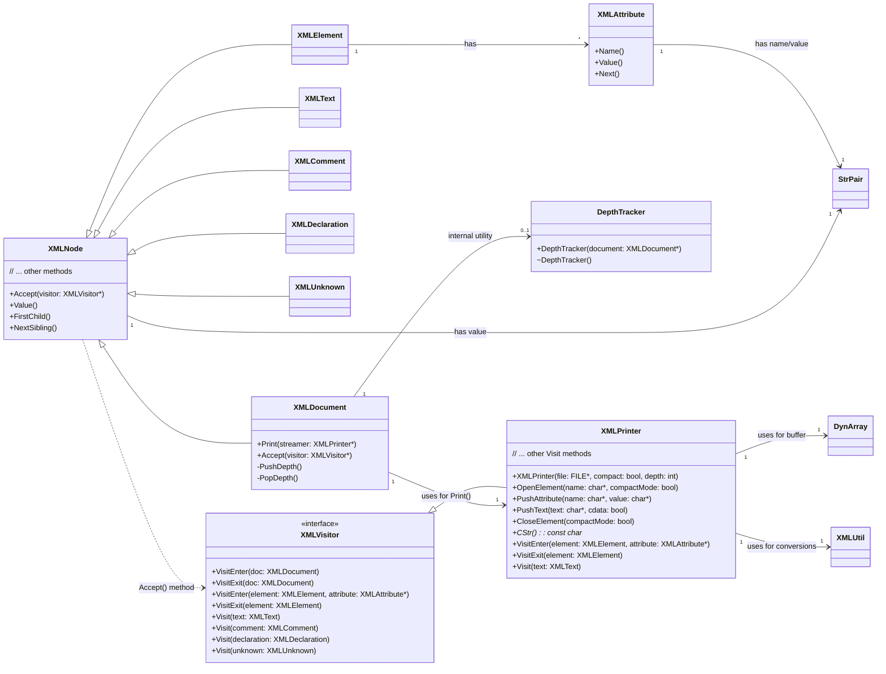
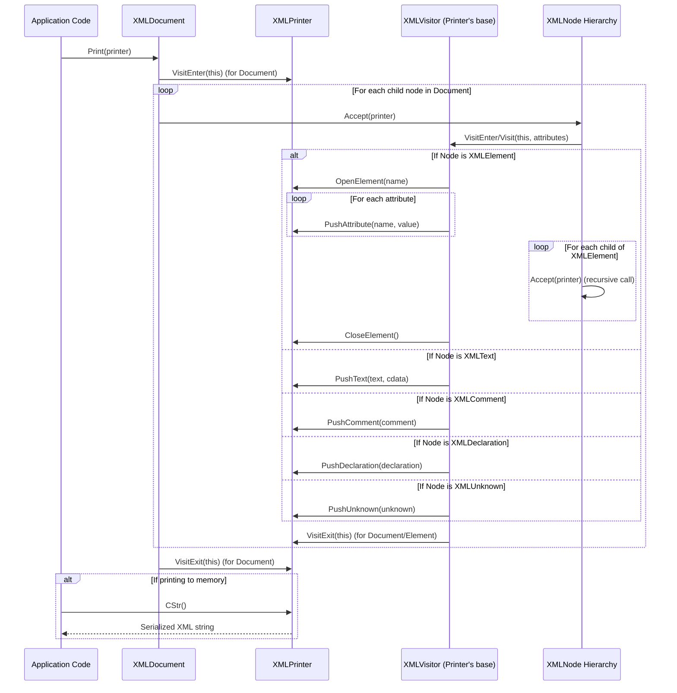

# TinyXML-2 Serialization and Printing Module Documentation

## 1. Introduction

The `TinyXML-2_Serialization_and_Printing` module is responsible for converting the in-memory XML Document Object Model (DOM) representation into a serialized string or file format. It provides the core mechanisms for traversing the XML tree and generating well-formed XML output, offering flexibility for both memory-based and file-based printing, as well as options for compact or human-readable output.

## 2. Core Components

This module primarily consists of the following core components:

### 2.1. `XMLVisitor`

*   **Purpose:** Implements the [Visitor design pattern](https://en.wikipedia.org/wiki/Visitor_pattern), allowing for a hierarchical traversal of the XML DOM. It defines a set of virtual methods (`VisitEnter`, `VisitExit`, `Visit`) that are called back for different types of XML nodes (`XMLDocument`, `XMLElement`, `XMLText`, `XMLComment`, `XMLDeclaration`, `XMLUnknown`).
*   **Functionality:** Users can derive from `XMLVisitor` and override specific `Visit` methods to implement custom logic during DOM traversal, such as data extraction, transformation, or validation. Returning `true` from a `Visit` method continues the traversal, while `false` stops it for the current branch.
*   **Relationship:** Interacts directly with the `XMLNode` hierarchy (defined in [TinyXML-2_Core_XML_Structures.md](TinyXML-2_Core_XML_Structures.md)) through the `Accept()` method.

### 2.2. `XMLPrinter`

*   **Purpose:** A concrete implementation of `XMLVisitor` specifically designed for serializing the XML DOM into a string buffer or a `FILE*`. It handles the formatting, indentation, and entity escaping necessary to produce valid XML output.
*   **Functionality:**
    *   **Construction:** Can be initialized with a `FILE*` for direct file output or without one to print to an internal memory buffer (accessible via `CStr()`). It also supports `compact` mode for minimal whitespace.
    *   **Streaming API:** Provides methods like `OpenElement()`, `PushAttribute()`, `PushText()`, `PushComment()`, `PushDeclaration()`, `PushUnknown()`, and `CloseElement()` for building XML output programmatically without a full DOM.
    *   **Visitor Implementation:** Overrides `XMLVisitor` methods to implement the actual printing logic for each node type during a DOM traversal initiated by `XMLDocument::Print()`.
    *   **Buffer Management:** Manages an internal `DynArray<char>` to store the serialized XML when printing to memory.
*   **Relationship:** Inherits from `XMLVisitor`. Used by `XMLDocument` (defined in [TinyXML-2_Document_Management.md](TinyXML-2_Document_Management.md)) for its `Print()` method. Relies on `XMLUtil` (defined in [TinyXML-2_Parsing_and_Utility.md](TinyXML-2_Parsing_and_Utility.md)) for string conversions and utility functions.

### 2.3. `DepthTracker`

*   **Purpose:** An internal utility class used by `XMLDocument` to track the current parsing depth. This is a security measure to prevent stack overflows that could result from excessively deep or maliciously crafted XML documents.
*   **Functionality:** Its constructor increments a depth counter in `XMLDocument`, and its destructor decrements it. If the depth exceeds `TINYXML2_MAX_ELEMENT_DEPTH`, an error is triggered.
*   **Relationship:** An internal helper class for `XMLDocument` (defined in [TinyXML-2_Document_Management.md](TinyXML-2_Document_Management.md)).

## 3. Architecture and Component Relationships

The `TinyXML-2_Serialization_and_Printing` module is built around the Visitor design pattern, enabling a clean separation between the XML structure and its serialization logic.



### 3.1. Dependencies

```mermaid
graph TD
    subgraph TinyXML-2_Serialization_and_Printing
        A[XMLVisitor]
        B[XMLPrinter]
        C[DepthTracker]
    end

    subgraph TinyXML-2_Core_XML_Structures
        D[XMLNode]
        E[XMLElement]
        F[XMLText]
        G[XMLComment]
        H[XMLDeclaration]
        I[XMLUnknown]
        J[XMLAttribute]
    end

    subgraph TinyXML-2_Document_Management
        K[XMLDocument]
    end

    subgraph TinyXML-2_Parsing_and_Utility
        L[StrPair]
        M[XMLUtil]
    end

    subgraph TinyXML-2_Memory_Management
        N[DynArray]
    end

    B --> A : inherits
    K --> B : uses (Print method)
    K --> C : uses internally
    A --> D : visits
    A --> E : visits
    A --> F : visits
    A --> G : visits
    A --> H : visits
    A --> I : visits
    B --> J : processes attributes
    B --> L : uses StrPair for internal strings
    B --> N : uses DynArray for buffer
    B --> M : uses XMLUtil for type conversions
    J --> L : has StrPair for name/value
    D --> L : has StrPair for value
```

### 3.2. Data Flow / Component Interaction (Serialization Process)



## 4. How the Module Fits into the Overall System

The `TinyXML-2_Serialization_and_Printing` module forms the output layer of the TinyXML-2 library. After an XML document has been parsed (using components from [TinyXML-2_Parsing_and_Utility.md](TinyXML-2_Parsing_and_Utility.md)) and represented in memory using the core XML structures (from [TinyXML-2_Core_XML_Structures.md](TinyXML-2_Core_XML_Structures.md) and [TinyXML-2_Document_Management.md](TinyXML-2_Document_Management.md)), this module enables its conversion back into a textual XML format.

It is essential for:
*   **Saving Modified Documents:** Persisting changes made to an XML document back to a file.
*   **Generating XML Programmatically:** Creating XML output directly from application data without first building a full DOM, using the `XMLPrinter`'s streaming API.
*   **Debugging and Logging:** Outputting XML structures for inspection.
*   **Interoperability:** Providing a standard XML string representation for communication with other systems or services.

This module completes the round-trip functionality of TinyXML-2, allowing applications to both read and write XML data effectively.
