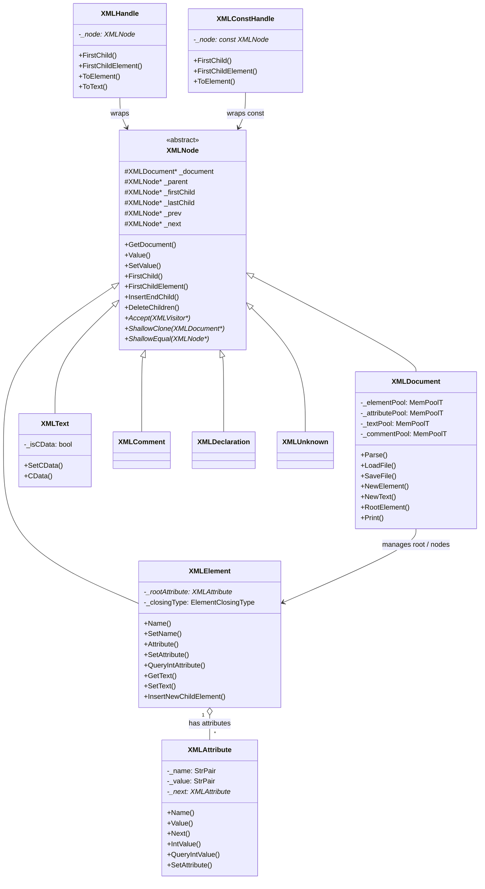
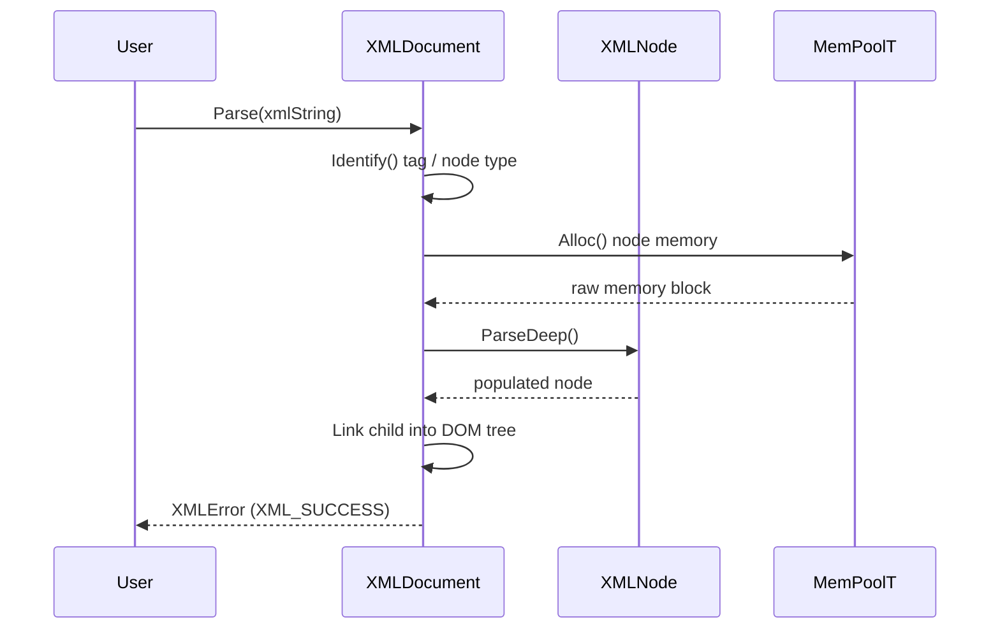

# TinyXML-2 DOM Module Documentation

## Introduction

The **TinyXML-2 DOM** module forms the core Document Object Model (DOM) of the TinyXML-2 library. It provides a lightweight, efficient C++ representation of an XML document tree, including elements, attributes, text nodes, comments, declarations, and unknown/DTD tags. 

The module manages memory centrally through `XMLDocument`, ensuring that all nodes belonging to a document are allocated efficiently using internal memory pools (`MemPoolT`) and deleted automatically when the document is destroyed. It also offers helper wrappers (`XMLHandle` and `XMLConstHandle`) for safe, concise traversal of deep node hierarchies without cumbersome null-pointer checks.

---

## Architecture and Component Relationships

The DOM module centers around `XMLDocument` and `XMLNode`, which establish a hierarchical tree structure. Attributes (`XMLAttribute`) are associated with elements as ordered name-value pairs but do not participate in the general node tree hierarchy.

### Class Diagram

---

## Core Components

### 1. `XMLNode`
The abstract base class for every object in the XML DOM (except attributes). It maintains navigation pointers (`_parent`, `_firstChild`, `_lastChild`, `_prev`, `_next`), provides methods for traversing and mutating the tree, and defines virtual hooks for cloning (`ShallowClone`), equality comparison (`ShallowEqual`), and visiting (`Accept`).

### 2. `XMLDocument`
Represents the root XML document container. It inherits from `XMLNode` and acts as the central factory and memory manager for all nodes (`XMLElement`, `XMLText`, `XMLComment`, `XMLDeclaration`, `XMLUnknown`) and attributes (`XMLAttribute`) via internal memory pools (`MemPoolT`). It handles loading/saving files, parsing memory buffers, tracking parsing errors, and enforcing recursion depth limits (`DepthTracker`).

### 3. `XMLElement`
Represents an XML element tag (e.g., `<foo attribute="bar">`). It maintains an ordered list of `XMLAttribute` objects and can contain child elements, text, comments, and unknown nodes. It provides convenient methods for querying attributes and child text with automatic type conversion (int, float, double, bool, int64, etc.) and helper methods like `InsertNewChildElement()`.

### 4. `XMLAttribute`
Represents a name-value pair attached to an `XMLElement`. Attributes are stored in a singly-linked list (`_next`) owned by the element. They support type-safe querying and modification (`QueryIntValue`, `SetAttribute`, etc.).

### 5. `XMLText`
Represents text content within an element, supporting standard text or CDATA formatting (`SetCData`, `CData`).

### 6. `XMLComment`, `XMLDeclaration`, `XMLUnknown`
Leaf node classes representing XML comments (`<!-- comment -->`), XML declarations (`<?xml ... ?>`), and unknown/DTD tags respectively.

### 7. `XMLHandle` and `XMLConstHandle`
Utility wrapper classes that wrap an `XMLNode` pointer (or `const XMLNode*`) with built-in null-pointer checks. They enable fluent, concise chaining of navigation methods (e.g., `docHandle.FirstChildElement("Doc").FirstChildElement("Elem").ToElement()`) without intermediate null checks.

---

## Data Flow and Process Flows

### Document Parsing Flow
When `XMLDocument::Parse()` or `LoadFile()` is invoked, the document processes the raw character buffer, identifying nodes recursively using `ParseDeep()` methods while tracking recursion depth to prevent stack overflow attacks.

### Safe Navigation with `XMLHandle`
`XMLHandle` intercepts navigation calls, verifying whether the underlying node pointer is valid before returning a new handle wrapping the target child or sibling node. If any step along the chain returns `null`, subsequent method calls safely return null handles instead of dereferencing null pointers.

---

## Dependencies

- **[TinyXML-2_visitor](TinyXML-2_visitor.md)**: Utilized via the `Accept()` method on `XMLNode` and `XMLDocument` subclasses, allowing visitors (such as `XMLPrinter`) to traverse the DOM hierarchy.
- **[TinyXML-2_memory_utils](TinyXML-2_memory_utils.md)**: Relies on `MemPool`, `MemPoolT`, `DynArray`, `StrPair`, and `XMLUtil` for memory pooling, dynamic arrays, string handling, whitespace skipping, entity processing, and type conversions.
