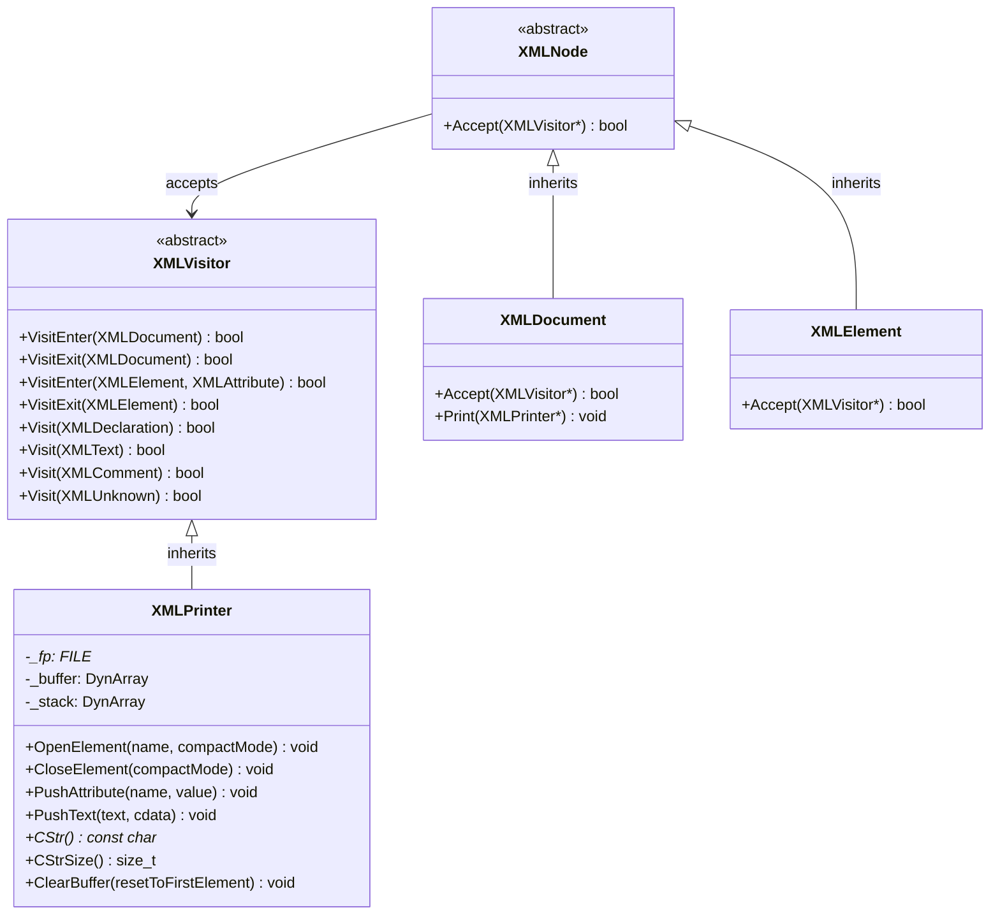
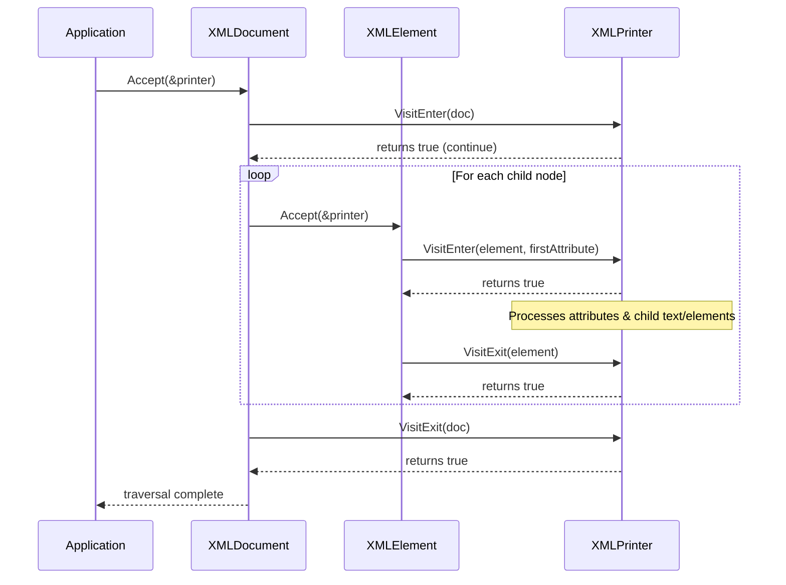

# TinyXML-2_visitor Module Documentation

## 1. Introduction and Purpose

The **TinyXML-2_visitor** module provides the visitor pattern infrastructure for traversing and serializing the TinyXML-2 Document Object Model (DOM). It acts as a SAX-like interface that allows developers to inspect, query, or export XML structures without modifying the underlying DOM nodes or requiring complex manual traversal code.

The core components defined in this module are:
- **`XMLVisitor`**: An abstract base class defining callback interfaces for visiting various XML nodes (`XMLDocument`, `XMLElement`, `XMLText`, `XMLComment`, `XMLDeclaration`, `XMLUnknown`).
- **`XMLPrinter`**: A concrete implementation of `XMLVisitor` that serializes XML documents or streams XML content directly to memory, standard output, or file pointers.

---

## 2. Architecture and Component Relationships

The visitor module sits on top of the [TinyXML-2_dom](TinyXML-2_dom.md) and interacts closely with memory utilities from [TinyXML-2_memory_utils](TinyXML-2_memory_utils.md). 



### Component Breakdown

1. **`XMLVisitor`**
   - Defines virtual callback methods (`VisitEnter`, `VisitExit`, and overloaded `Visit`) returning a `bool`.
   - Returning `true` continues recursive traversal; returning `false` halts traversal of the current node's children and siblings.
   - Default implementations return `true`, allowing subclasses to override only the node types of interest.

2. **`XMLPrinter`**
   - Inherits from `XMLVisitor` and implements both document visiting (for DOM serialization via `XMLNode::Accept()`) and direct stream writing (for programmatic XML generation without creating a DOM).
   - Manages an internal text buffer (`DynArray<char, 20>`) for in-memory serialization and an element stack (`DynArray<const char*, 10>`) to track open tags.
   - Supports formatting options such as compact mode, custom indentation, and quote escaping in attributes.

---

## 3. Data Flow and Process Flows

### XML Tree Traversal and Visiting Flow

When `XMLNode::Accept(XMLVisitor* visitor)` is called on a document or element, it recursively invokes visitor callbacks depending on the node type.



### Streaming vs. DOM Printing Flow

`XMLPrinter` can operate in two distinct modes:

1. **DOM Printing Mode**: Traversing an existing in-memory DOM via `XMLDocument::Print(XMLPrinter*)` or `XMLNode::Accept()`.
2. **Streaming Mode**: Directly invoking `OpenElement()`, `PushAttribute()`, `PushText()`, and `CloseElement()` to output XML directly to a `FILE*` or memory buffer without building a DOM tree.

```mermaid
flowchart TD
    Start([Start Printing]) --> CheckMode{Streaming or DOM?}
    
    CheckMode -->|DOM Tree| DOMCall[Call Document::Print / Accept]
    DOMCall --> VisitNodes[VisitEnter / Visit / VisitExit callbacks]
    VisitNodes --> FormatOutput[Format & Write to Buffer / FILE]
    
    CheckMode -->|Streaming| StreamCall[Direct API Calls: OpenElement, PushText, etc.]
    StreamCall --> FormatOutput
    
    FormatOutput --> End([Output XML CStr / File])
    
    sub_utils[Uses XMLUtil & DynArray for buffer management]
    FormatOutput -.-> sub_utils
