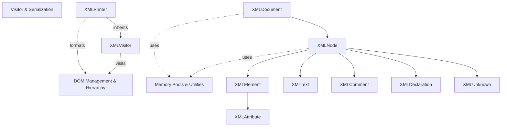
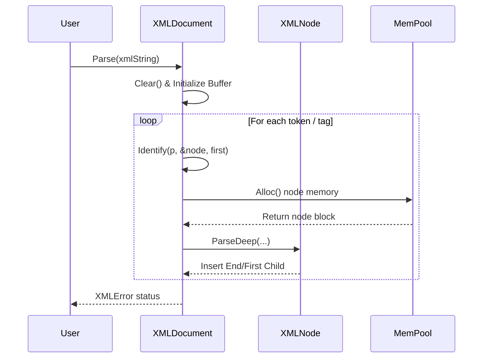

# TinyXML-2 Documentation

## Overview

**TinyXML-2** is a simple, small, efficient, and robust C++ XML parser designed to be easily integrated into other programs. Unlike its predecessor (TinyXML), TinyXML-2 uses parsing memory more efficiently, reduces memory fragmentation by utilizing fixed-size memory pools for DOM node allocation, and provides a clean object-oriented Document Object Model (DOM) interface.

---

## Architecture Overview

TinyXML-2 is structured into three primary functional sub-modules:
1. **DOM Management & Node Hierarchy** ([TinyXML-2_dom.md](TinyXML-2_dom.md)) - Manages the document tree structure, elements, attributes, text nodes, comments, declarations, and safe pointer handles.
2. **Visitor & Serialization** ([TinyXML-2_visitor.md](TinyXML-2_visitor.md)) - Implements the Visitor pattern for traversing the DOM tree and handles XML formatting and streaming via `XMLPrinter`.
3. **Memory Management & Utilities** ([TinyXML-2_memory_utils.md](TinyXML-2_memory_utils.md)) - Provides block memory pooling (`MemPool`, `MemPoolT`), dynamic arrays (`DynArray`), string wrapping (`StrPair`), entity mapping, and UTF/primitive conversion utilities (`XMLUtil`).

---

## Sub-Modules

### 1. DOM Management & Node Hierarchy
* **Description:** Represents the core XML document tree. `XMLDocument` serves as the root owner and allocator for all nodes (`XMLElement`, `XMLText`, `XMLComment`, `XMLDeclaration`, `XMLUnknown`) and attributes (`XMLAttribute`).
* **Key Components:** `XMLDocument`, `XMLNode`, `XMLElement`, `XMLAttribute`, `XMLText`, `XMLComment`, `XMLDeclaration`, `XMLUnknown`, `XMLHandle`, `XMLConstHandle`.
* **Documentation:** Refer to [TinyXML-2_dom.md](TinyXML-2_dom.md).

### 2. Visitor & Serialization
* **Description:** Provides traversal mechanisms over the DOM tree using the Visitor pattern (`XMLVisitor`) and custom formatting/streaming output (`XMLPrinter`) supporting both memory buffers and file streams.
* **Key Components:** `XMLVisitor`, `XMLPrinter`.
* **Documentation:** Refer to [TinyXML-2_visitor.md](TinyXML-2_visitor.md).

### 3. Memory Management & Utilities
* **Description:** Low-level support mechanisms including custom chunk-based memory pools (`MemPool`, `MemPoolT`) to prevent heap fragmentation, dynamic POD arrays (`DynArray`), string manipulation (`StrPair`), and character encoding/parsing helpers (`XMLUtil`).
* **Key Components:** `MemPool`, `MemPoolT`, `DynArray`, `StrPair`, `XMLUtil`, `Entity`.
* **Documentation:** Refer to [TinyXML-2_memory_utils.md](TinyXML-2_memory_utils.md).

---

## Data Flow & Core Process

### Parsing Workflow
When loading or parsing XML data (via `XMLDocument::LoadFile` or `XMLDocument::Parse`), TinyXML-2 tokenizes the input string buffer, identifies node types, allocates nodes from dedicated memory pools, builds parent-child relationships, and validates nesting depth against `TINYXML2_MAX_ELEMENT_DEPTH`.

