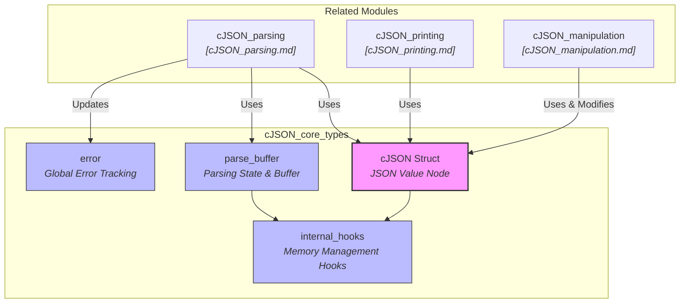
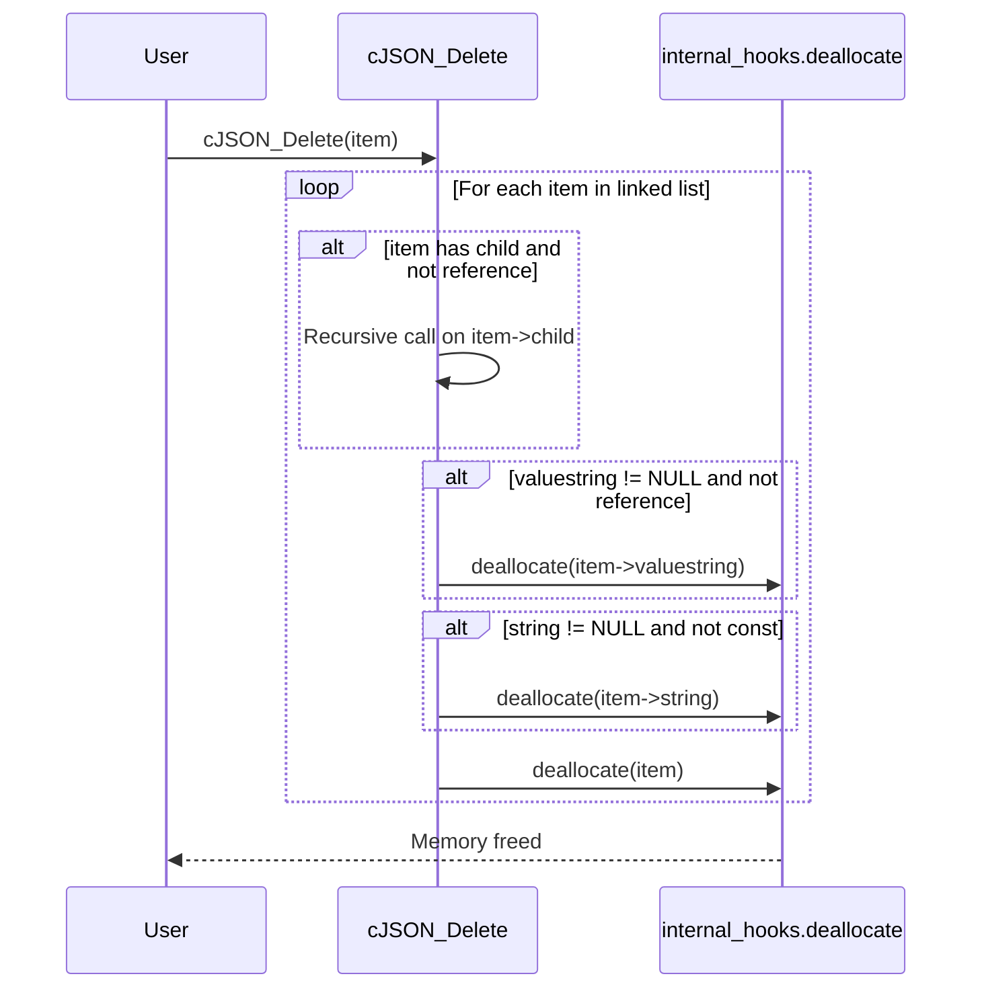

# cJSON Core Types Module Documentation

## Introduction

The `cJSON_core_types` module forms the foundational data structures and core utility mechanisms for the `cJSON` library. It defines the primary `cJSON` struct (representing JSON objects, arrays, strings, numbers, booleans, and null values), memory allocation hooks (`internal_hooks`), parsing buffers (`parse_buffer`), error tracking structures (`error`), and fundamental helper functions for managing object lifecycles, versioning, and basic type checks.

---

## Architecture & Core Components

The module encompasses the core definitions used across all other sub-modules (`cJSON_parsing`, `cJSON_printing`, and `cJSON_manipulation`). Below is the architectural relationship and data flow between these core structures:



---

## Component Details

### 1. `cJSON` Struct (Core Data Representation)
The `cJSON` structure represents a node in the JSON document tree. It can act as a primitive value, a string, an array, or an object.

- **Pointers**: `next` and `prev` form a doubly linked list for sibling elements (e.g., inside an object or array). `child` points to the head of a linked list if the node is an array or object.
- **Type Flags**: `type` bitfield indicates the data type (`cJSON_False`, `cJSON_True`, `cJSON_NULL`, `cJSON_Number`, `cJSON_String`, `cJSON_Array`, `cJSON_Object`, etc.) and memory ownership flags (`cJSON_IsReference`, `cJSON_StringIsConst`).
- **Values**: Stores string values (`valuestring`), integer values (`valueint`), and floating-point values (`valuedouble`).
- **Key**: `string` stores the key name if the item is a child of a JSON Object.

### 2. Memory Hooks (`internal_hooks`)
Defines function pointers for memory allocation, deallocation, and reallocation:
```c
typedef struct internal_hooks
{
    void *(CJSON_CDECL *allocate)(size_t size);
    void (CJSON_CDECL *deallocate)(void *pointer);
    void *(CJSON_CDECL *reallocate)(void *pointer, size_t size);
} internal_hooks;
```
Initialized via `cJSON_InitHooks` to allow users to plug in custom memory allocators.

### 3. Parsing Buffer (`parse_buffer`)
Tracks the state of input parsing across buffer offsets, string lengths, nesting depth, and associated hooks:
```c
typedef struct
{
    const unsigned char *content;
    size_t length;
    size_t offset;
    size_t depth;
    internal_hooks hooks;
} parse_buffer;
```

### 4. Error Tracking (`error`)
Records parsing errors with pointer locations:
```c
typedef struct {
    const unsigned char *json;
    size_t position;
} error;
```
Exposed to public API users via `cJSON_GetErrorPtr()`.

---

## Component Interaction & Process Flow

### Lifecycle & Deletion Flow (`cJSON_Delete`)
When a JSON tree is destroyed, `cJSON_Delete` traverses the linked list and hierarchy recursively, respecting reference and constancy flags before releasing memory through the configured deallocation hooks.



---

## Related Modules

- **Parsing**: Refer to [cJSON_parsing.md](cJSON_parsing.md) for details on how `parse_buffer` and input strings are tokenized into `cJSON` structures.
- **Printing**: Refer to [cJSON_printing.md](cJSON_printing.md) for how `cJSON` trees are serialized back into JSON string representations.
- **Manipulation**: Refer to [cJSON_manipulation.md](cJSON_manipulation.md) for adding, removing, replacing, and querying elements within `cJSON` trees.
