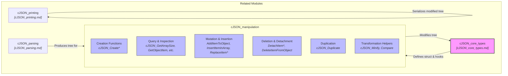
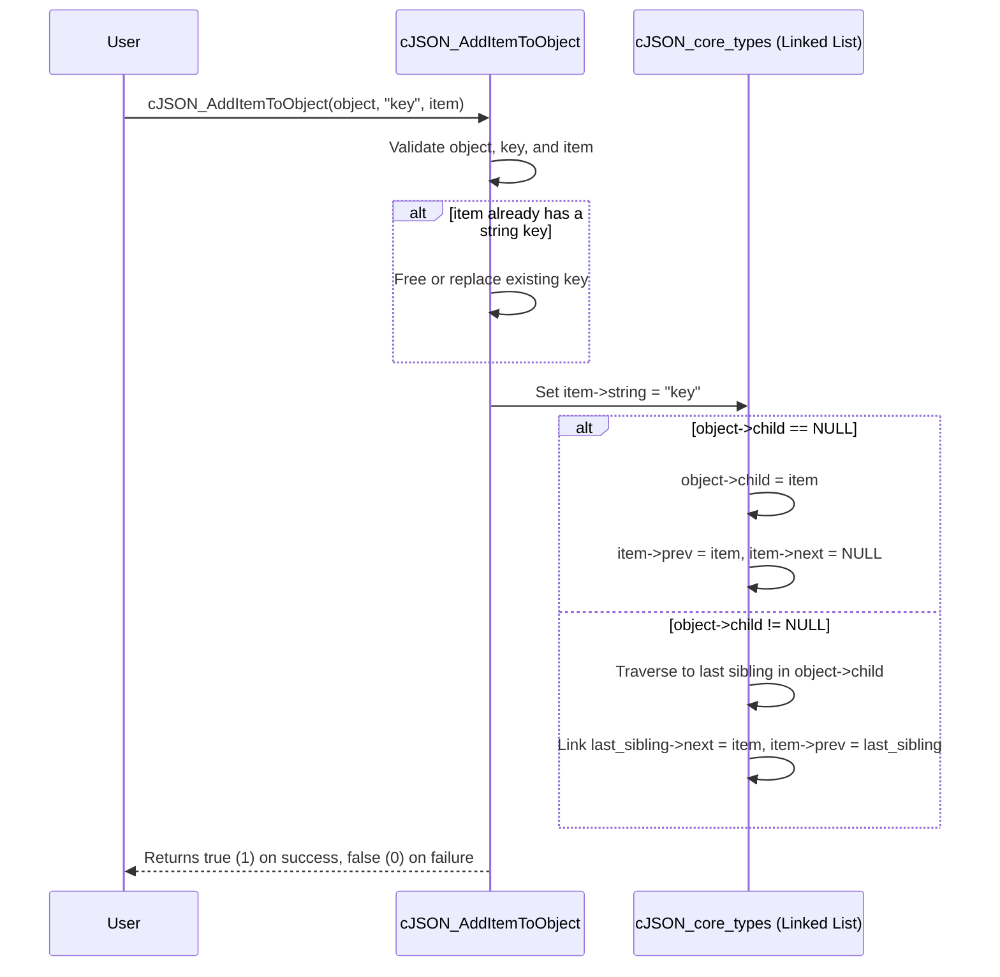

# cJSON Manipulation Module Documentation

## Introduction

The `cJSON_manipulation` module provides a comprehensive suite of functions for creating, querying, modifying, adding, deleting, duplicating, and transforming JSON structures (`cJSON` nodes) within the `cJSON` library. It builds directly upon the foundational types defined in [cJSON_core_types.md](cJSON_core_types.md) and works in tandem with [cJSON_parsing.md](cJSON_parsing.md) and [cJSON_printing.md](cJSON_printing.md) to enable full in-memory manipulation of JSON data trees (objects, arrays, strings, numbers, booleans, and nulls).

---

## Architecture & Core Components

The manipulation module interacts heavily with the core `cJSON` struct, performing tree traversal, pointer adjustments for doubly linked lists, type casting, item insertion/detachment, and deep/shallow duplication.

---

## Component Details

### 1. Creation Functions
Factories for allocating and initializing specific types of `cJSON` items:
- **Null / Booleans / Numbers / Strings**: `cJSON_CreateNull()`, `cJSON_CreateTrue()`, `cJSON_CreateFalse()`, `cJSON_CreateBool()`, `cJSON_CreateNumber()`, `cJSON_CreateString()`, `cJSON_CreateRaw()`.
- **Arrays & Objects**: `cJSON_CreateArray()`, `cJSON_CreateObject()`.
- **Typed Helper Arrays/Lists**: `cJSON_CreateIntArray()`, `cJSON_CreateFloatArray()`, `cJSON_CreateDoubleArray()`, `cJSON_CreateStringArray()`.

### 2. Query & Inspection Functions
Functions to query properties, size, and search within arrays and objects:
- **Array Size & Indexing**: `cJSON_GetArraySize(array)`, `cJSON_GetArrayItem(array, index)`.
- **Object Key Lookups**: `cJSON_GetObjectItem(object, string)`, `cJSON_GetObjectItemCaseSensitive(object, string)`, `cJSON_HasObjectItem(object, string)`.
- **Type Checkers**: Macros and functions verifying node types (`cJSON_IsInvalid`, `cJSON_IsFalse`, `cJSON_IsTrue`, `cJSON_IsNull`, `cJSON_IsNumber`, `cJSON_IsString`, `cJSON_IsArray`, `cJSON_IsObject`, `cJSON_IsRaw`).

### 3. Mutation & Insertion Functions
Functions to add items to objects and arrays, or replace existing nodes:
- **Adding to Objects / Arrays**: 
  - `cJSON_AddItemToArray(array, item)`
  - `cJSON_AddItemToObject(object, string, item)`
  - `cJSON_AddItemToObjectCS(object, string, item)` (Constant/Static string keys)
  - `cJSON_AddItemReferenceToArray(array, item)`
  - `cJSON_AddItemReferenceToObject(object, string, item)`
- **Inserting Items**:
  - `cJSON_InsertItemInArray(array, index, item)`
- **Replacing Items**:
  - `cJSON_ReplaceItemInArray(array, index, newItem)`
  - `cJSON_ReplaceItemInObject(object, string, newItem)`
  - `cJSON_ReplaceItemInObjectCaseSensitive(object, string, newItem)`

### 4. Deletion & Detachment Functions
Functions to remove or extract items without necessarily destroying them immediately:
- **Detaching**:
  - `cJSON_DetachItemFromIArray(array, index)` -> returns detached item.
  - `cJSON_DetachItemViaPointer(parent, item)`
  - `cJSON_DetachItemFromObject(object, string)`
  - `cJSON_DetachItemFromObjectCaseSensitive(object, string)`
- **Deleting**:
  - `cJSON_DeleteItemFromIArray(array, index)`
  - `cJSON_DeleteItemFromObject(object, string)`
  - `cJSON_DeleteItemFromObjectCaseSensitive(object, string)`
  *(Note: Complete tree destruction is handled by `cJSON_Delete` as detailed in [cJSON_core_types.md](cJSON_core_types.md).)*

### 5. Duplication
- `cJSON_Duplicate(item, recurse)`: Duplicates an item. If `recurse` is non-zero, it recursively duplicates all child elements and nested objects/arrays. Supports shallow references (`cJSON_IsReference`).

### 6. Utility & Transformation Helpers
- `cJSON_Minify(json)`: Removes whitespace and comments in-place from a JSON string.
- `cJSON_Compare(a, b)`: Recursively compares two JSON values for structural and value equality.

---

## Component Interaction & Process Flow

### Adding an Item to a JSON Object Flow
When an item is added to an object via `cJSON_AddItemToObject`, the key string is assigned, type flags are updated, and the item is appended to the object's child linked list.

---

## Related Modules

- **Core Types**: Refer to [cJSON_core_types.md](cJSON_core_types.md) for foundational structures (`cJSON`), memory hooks, and deletion mechanics (`cJSON_Delete`).
- **Parsing**: Refer to [cJSON_parsing.md](cJSON_parsing.md) for generating initial `cJSON` trees from raw JSON strings.
- **Printing**: Refer to [cJSON_printing.md](cJSON_printing.md) for serializing manipulated `cJSON` trees back into formatted JSON strings.
