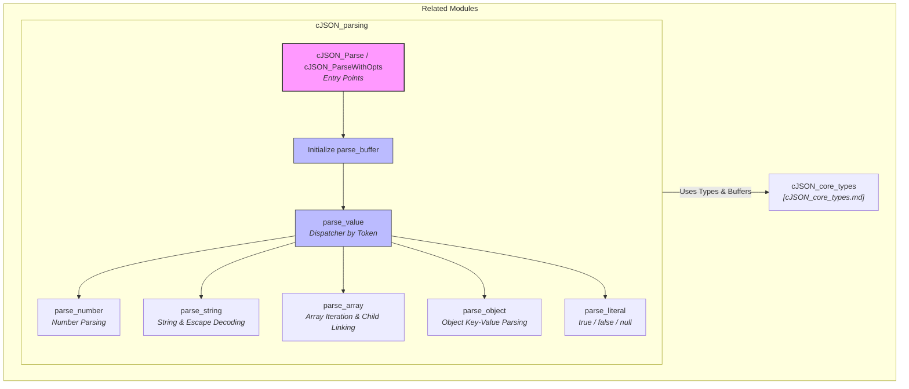
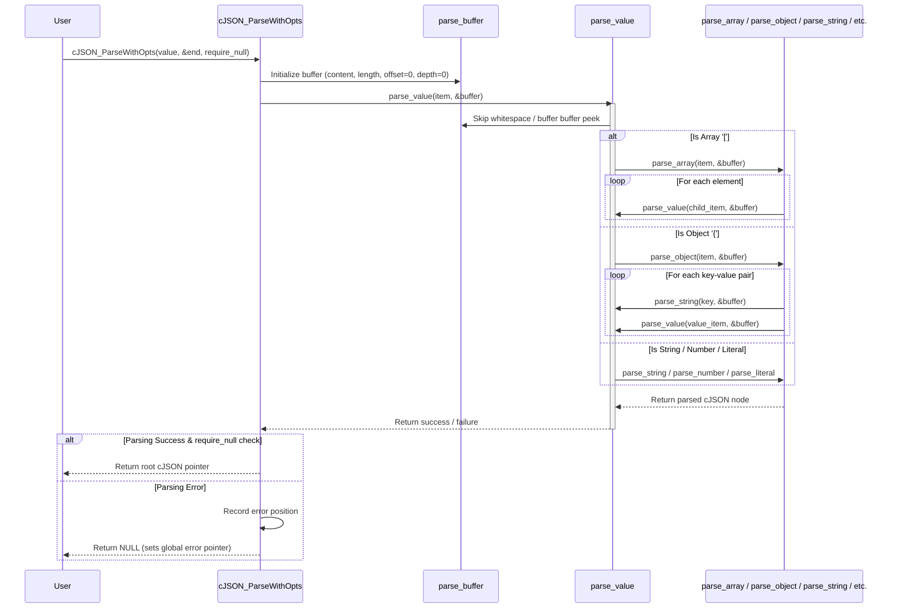

# cJSON Parsing Module Documentation

## Introduction

The `cJSON_parsing` module is responsible for deserializing JSON text strings into hierarchical `cJSON` data structures. It utilizes the core utilities and data types defined in the [cJSON_core_types.md](cJSON_core_types.md) module—specifically relying on `parse_buffer`, `internal_hooks`, and the `error` tracking mechanism—to tokenize and parse JSON values, arrays, objects, strings, numbers, booleans, and nulls with robust error reporting and depth-limit checks.

---

## Architecture & Core Components

The parsing module processes raw unsigned character strings through a sequential set of parsing functions guided by the `parse_buffer` state. 

---

## Component Details

### 1. Entry Point Functions
- **`cJSON_Parse(const char *value)`**: Convenience wrapper around `cJSON_ParseWithOpts` with default options (no explicit return parse end pointer, requiring full consumption or successful parse).
- **`cJSON_ParseWithOpts(const char *value, const char **return_parse_end, cJSON_bool require_null_terminated)`**: Configures buffer parameters, initializes the parsing state, handles buffer length calculation, enforces memory hooks, and manages error tracking locations if parsing fails.

### 2. Value Dispatcher (`parse_value`)
The core routing function that inspects whitespace and leading characters in the `parse_buffer` to dispatch parsing to the appropriate handler:
- `"` or `u8'"'` $\rightarrow$ `parse_string`
- `[` $\rightarrow$ `parse_array`
- `{` $\rightarrow$ `parse_object`
- `-` or `0-9` $\rightarrow$ `parse_number`
- `t`, `f`, `n` $\rightarrow$ `parse_literal` (`true`, `false`, `null`)

### 3. Specialized Parsers
- **`parse_number`**: Parses integer and floating-point representations, handling scientific notation (`e`/`E`), negative signs, exponents, and validating numeric boundaries into `valuedouble` and `valueint`.
- **`parse_string`**: Handles quoted strings, decodes UTF-8 sequences and JSON escape characters (`\n`, `\t`, `\r`, `\b`, `\f`, `\/`, `\"`, and Unicode `\uXXXX` surrogate pairs).
- **`parse_array`**: Iterates through comma-separated values inside square brackets `[...]`, building a doubly linked list of sibling `cJSON` nodes linked via `child`. Enforces maximum nesting depth limits (`cJSON_NESTING_LIMIT`).
- **`parse_object`**: Parses key-value pairs inside curly braces `{...}`, where each item's `string` field holds the parsed object key and `child` points to the value subtree.
- **`parse_literal`**: Validates and constructs boolean (`cJSON_True`, `cJSON_False`) and null (`cJSON_NULL`) nodes.

---

## Component Interaction & Process Flow

### JSON Parsing Sequence Flow

The following sequence diagram illustrates how `cJSON_ParseWithOpts` orchestrates the parsing process using `parse_buffer` and delegates to specific parsing functions:

---

## Related Modules

- **Core Types & Buffers**: Refer to [cJSON_core_types.md](cJSON_core_types.md) for the definition of `parse_buffer`, `internal_hooks`, and the `cJSON` struct populated during parsing.
- **Printing**: Refer to [cJSON_printing.md](cJSON_printing.md) for serializing parsed `cJSON` trees back into JSON string format.
- **Manipulation**: Refer to [cJSON_manipulation.md](cJSON_manipulation.md) for querying, modifying, adding, and removing elements in the resulting `cJSON` structure.
