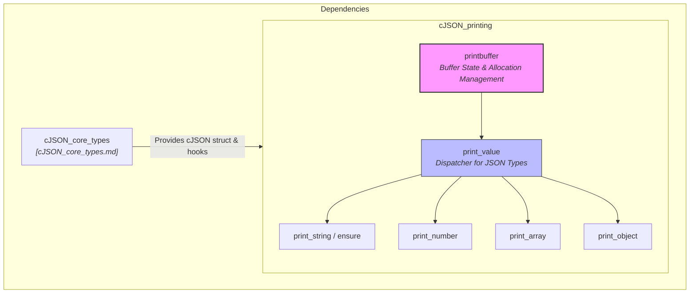
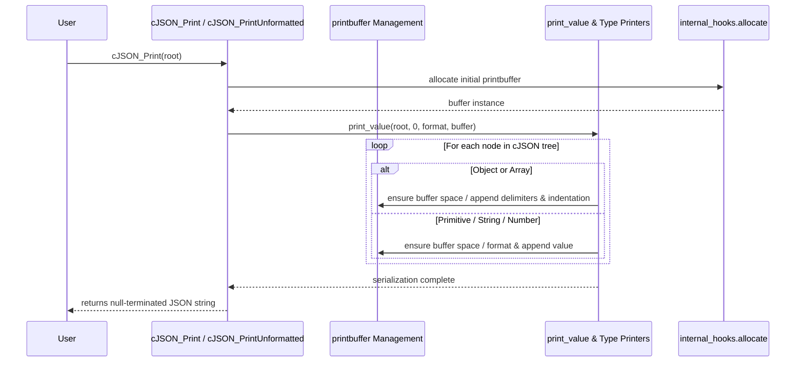

# cJSON Printing Module Documentation

## Introduction

The `cJSON_printing` module is responsible for serializing `cJSON` data structures back into valid JSON string representations. It provides robust mechanisms for both formatted (pretty-printed with indentation and newlines) and unformatted (compact) JSON output, as well as buffer management during the printing process.

---

## Architecture & Core Components

The printing module operates on the foundational data structures defined in the [cJSON_core_types.md](cJSON_core_types.md) module, taking a `cJSON` tree root and transforming it into a dynamically allocated string buffer (`printbuffer`).

---

## Component Details

### 1. Print Buffer (`printbuffer`)
The printing routines use an internal `printbuffer` structure to manage memory allocation, buffer growth, current write position, and formatting options (formatted vs. unformatted printing):
- **Buffer Management**: Automatically reallocates memory using custom memory hooks (`internal_hooks`) when the buffer capacity is exceeded.
- **Buffer Growth Strategy**: Employs exponential or incremental growth algorithms (`ensure`) to minimize reallocation overhead.
- **Formatting Flags**: Tracks indentation depth and whether spacing/newlines should be inserted (`format` boolean).

### 2. Serialization Functions
- **`cJSON_Print` & `cJSON_PrintUnformatted`**: Public API entry points that allocate a top-level `printbuffer`, invoke the root serialization, and return a null-terminated C string.
- **`cJSON_PrintBuffered`**: Allows printing into a pre-allocated or user-managed buffer size.
- **`cJSON_PrintPreallocated`**: Prints directly into a provided fixed-size buffer, ensuring safe memory bounds for embedded or memory-constrained environments.

- **Type-Specific Printers**:
  - `print_value`: Dispatches serialization based on the `cJSON` node type (`cJSON_True`, `cJSON_False`, `cJSON_NULL`, `cJSON_Number`, `cJSON_String`, `cJSON_Array`, `cJSON_Object`).
  - `print_string`: Handles string escaping (control characters, quotes, backslashes, Unicode escaping where applicable).
  - `print_number`: Formats integer and floating-point values accurately into string representation.
  - `print_array` & `print_object`: Iterates through linked-list child elements, handling separators (commas), brackets/braces (`[]`, `{}`), keys, and indentation formatting.

---

## Component Interaction & Process Flow

### Printing Execution Flow
The diagram below illustrates how a `cJSON` tree is serialized into a string buffer:

---

## Related Modules

- **Core Types**: Refer to [cJSON_core_types.md](cJSON_core_types.md) for definitions of the `cJSON` struct and memory allocation hooks.
- **Parsing**: Refer to [cJSON_parsing.md](cJSON_parsing.md) for how incoming JSON strings are converted into `cJSON` structures.
- **Manipulation**: Refer to [cJSON_manipulation.md](cJSON_manipulation.md) for modifying `cJSON` trees before printing.
