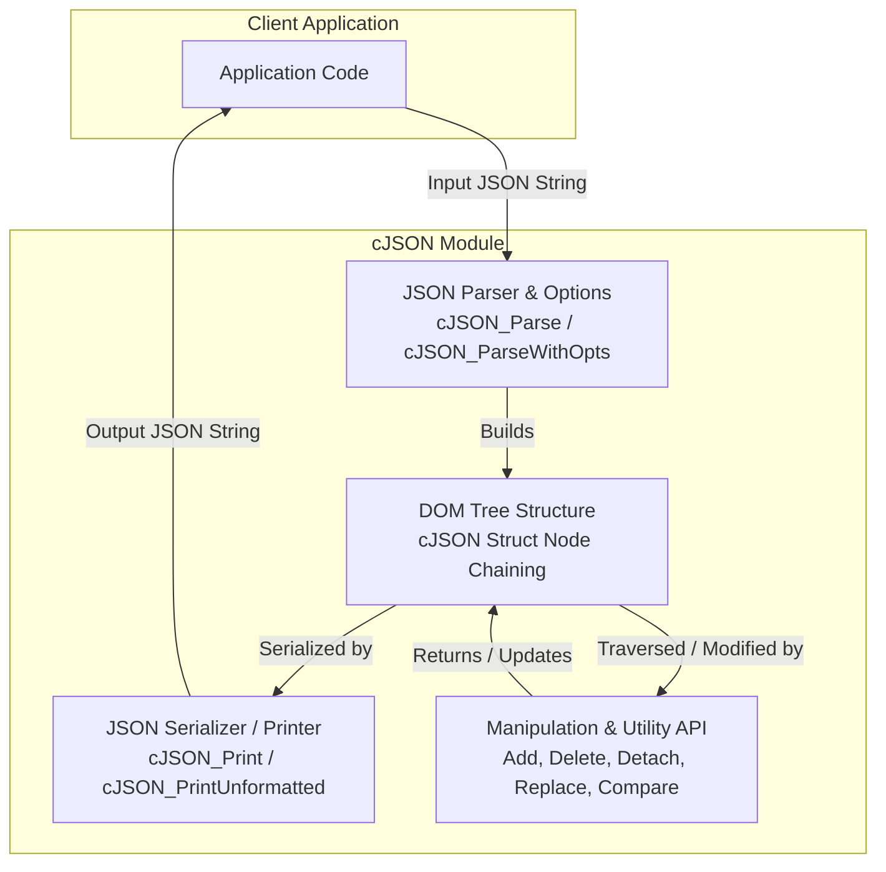
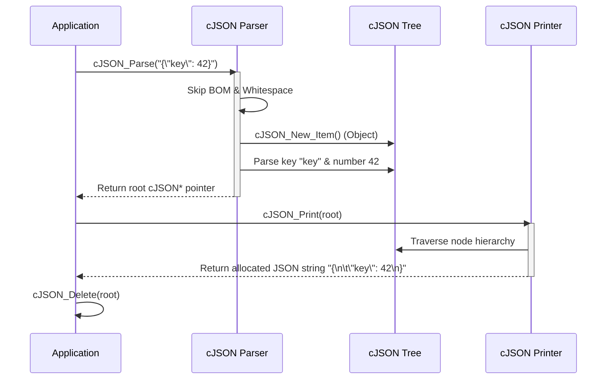

# cJSON Module Documentation

## Overview

The `cJSON` module is a lightweight, ultra-portable JSON parser and generator written in ANSI C (C89). It provides a straightforward DOM-like tree representation of JSON data structures (`cJSON`), allowing developers to easily parse JSON strings into memory trees, navigate and manipulate the nodes programmatically, compare structures, minify raw JSON data, and serialize trees back into formatted or unformatted JSON strings.

---

## Architecture Overview

`cJSON` centers around the `cJSON` data structure and helper mechanisms for memory management, parsing, printing, and item manipulation.

---

## Core Components

The module is primarily defined across two core files: `cJSON.h` (public API declarations and data structures) and `cJSON.c` (implementation details).

### 1. Data Structures (`cJSON.h`)
- **`cJSON`**: The foundational node struct representing any JSON value (null, boolean, number, string, array, object, or raw).
  - `next`, `prev`: Pointers for traversing sibling nodes within an array or object chain.
  - `child`: Pointer to the first child node if the item is an array or object.
  - `type`: Bitmask defining the data type (e.g., `cJSON_Number`, `cJSON_String`, `cJSON_Object`, etc.) and flags like `cJSON_IsReference` or `cJSON_StringIsConst`.
  - `valuestring`: Pointer to string value or raw JSON data.
  - `valueint`: Integer representation of number values (deprecated for direct write; use helpers).
  - `valuedouble`: Floating-point representation of number values.
  - `string`: Key name string if the item is the child of an object.
- **`cJSON_Hooks`**: Structure containing custom memory allocation (`malloc_fn`) and deallocation (`free_fn`) function pointers for integration into custom memory managers via `cJSON_InitHooks`.

### 2. Parsing (`cJSON.c`)
- **`cJSON_Parse` / `cJSON_ParseWithOpts` / `cJSON_ParseWithLengthOpts`**: Entry points for converting JSON text buffers into `cJSON` tree hierarchies. Handles whitespace skipping, UTF-8 BOM detection, nesting limit checks (`CJSON_NESTING_LIMIT`), and strict null-termination requirements.
- **Internal Parsers**: `parse_value`, `parse_object`, `parse_array`, `parse_string`, `parse_number`, and `utf16_literal_to_utf8`.

### 3. Printing / Serialization (`cJSON.c`)
- **`cJSON_Print` / `cJSON_PrintUnformatted` / `cJSON_PrintBuffered` / `cJSON_PrintPreallocated`**: Functions to serialize `cJSON` trees into standard JSON string representations, supporting formatted indentation and buffering strategies.

### 4. Manipulation & Tree Navigation (`cJSON.c`)
- **Query & Type Checking**: `cJSON_GetArraySize`, `cJSON_GetArrayItem`, `cJSON_GetObjectItem`, `cJSON_GetObjectItemCaseSensitive`, and type validators (`cJSON_IsNumber`, `cJSON_IsObject`, etc.).
- **Creation & Addition**: `cJSON_CreateObject`, `cJSON_CreateArray`, `cJSON_AddItemToArray`, `cJSON_AddItemToObject`, and convenience functions like `cJSON_AddStringToObject`.
- **Deletion, Detaching & Replacement**: `cJSON_Delete`, `cJSON_DetachItemViaPointer`, `cJSON_ReplaceItemViaPointer`, `cJSON_InsertItemInArray`.
- **Utilities**: `cJSON_Duplicate`, `cJSON_Compare`, `cJSON_Minify`, and `cJSON_ArrayForEach` iteration macro.

---

## Data Flow & Parsing Lifecycle

The lifecycle of parsing a JSON string and rendering it back is illustrated below:

---

## API Summary & Usage Notes

- **Memory Responsibility**: The caller is responsible for freeing strings returned by `cJSON_Print` (using standard `free` or `cJSON_free`) and entire DOM trees created by `cJSON_Parse` or creation helpers using `cJSON_Delete`.
- **Thread Safety**: `cJSON` is re-entrant and thread-safe provided that custom memory allocation hooks (`cJSON_InitHooks`) are thread-safe and distinct threads do not concurrently mutate the same `cJSON` tree without external synchronization.
