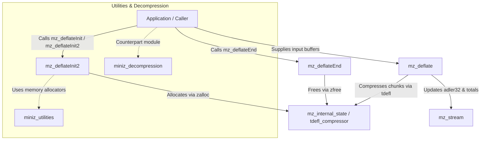
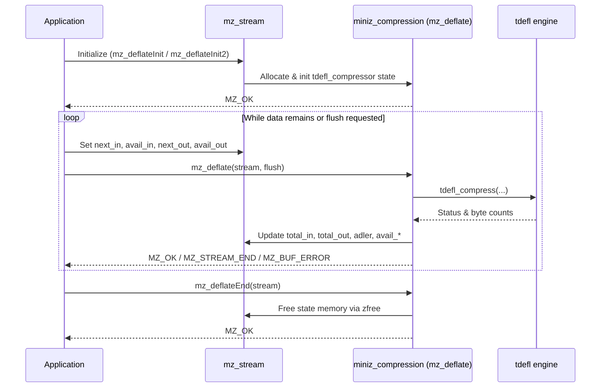

# miniz_compression Module Documentation

## Introduction

The `miniz_compression` module provides zlib-compatible compression APIs (`deflate`) for the `miniz` library. It bridges standard zlib stream management and buffer operations with underlying low-level compression primitives (`tdefl`), enabling memory-efficient block and stream compression.

---

## Architecture and Components

The module revolves around zlib-compatible stream structures and state management functions defined in `miniz.c`.

### Core Components

- **`mz_internal_state` / `tdefl_compressor`**: Internal representation of the compression state.
- **Initialization APIs**:
  - `mz_deflateInit`: Initializes a compression stream using default parameters.
  - `mz_deflateInit2`: Initializes a compression stream with custom level, method, window bits, memory level, and strategy.
- **Execution & Control APIs**:
  - `mz_deflate`: Compresses input data from the stream buffer with a specified flush type.
  - `mz_deflateReset`: Resets an active stream state for reuse without re-allocation.
  - `mz_deflateEnd`: Frees stream state resources and cleans up memory.
- **Helper & Utility APIs**:
  - `mz_deflateBound`: Estimates the upper bound of compressed data size for a given source length.
  - `mz_compress` / `mz_compress2`: Convenience wrappers for one-shot buffer compression.
  - `mz_compressBound`: Wrapper around `mz_deflateBound` for buffer sizing.

---

## System Integration & Data Flow

`miniz_compression` interacts directly with memory utilities (see [miniz_utilities](miniz_utilities.md)) and acts as the counterpart to the [miniz_decompression](miniz_decompression.md) module.

### Component Interaction Diagram

### Compression Process Flow

---

## See Also

- [miniz_decompression](miniz_decompression.md)
- [miniz_utilities](miniz_utilities.md)
