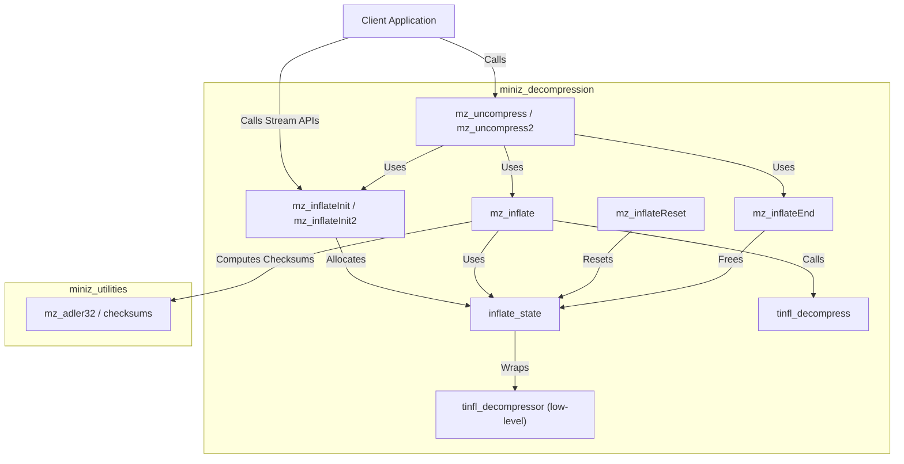
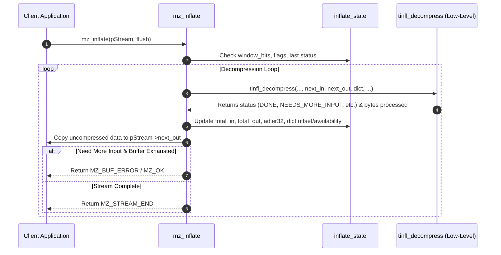

# Miniz Decompression Module Documentation

## Introduction

The `miniz_decompression` module provides zlib-compatible decompression APIs for the `miniz` library. It bridges zlib stream management (`mz_stream`, `inflate_state`) with the underlying low-level `tinfl` decompression routines. 

This module enables developers to initialize decompression streams, perform incremental or one-shot buffer uncompression (`mz_uncompress`, `mz_uncompress2`), handle zlib headers, manage sliding dictionaries, compute Adler-32 checksums, and properly clean up stream states.

---

## Architecture & Component Relationships

The module relies on core state structures and low-level routines to process compressed byte streams into uncompressed output.

### Core Components
- **`miniz.c::inflate_state`**: Internal state structure wrapping `tinfl_decompressor`, sliding dictionary buffer (`m_dict`), dictionary pointers, status tracking, and window bit configurations.
- **`miniz.c::mz_inflateInit`** / **`miniz.c::mz_inflateInit2`**: Initializes the `mz_stream` structure and allocates/initializes `inflate_state`.
- **`miniz.c::mz_inflate`**: Core decompression worker function that feeds input data into `tinfl_decompress`, manages the sliding dictionary (`TINFL_LZ_DICT_SIZE`), updates Adler-32 checksums, and handles buffer exhaustion/stream completion.
- **`miniz.c::mz_inflateReset`**: Resets an existing decompression stream state for reuse without reallocation.
- **`miniz.c::mz_inflateEnd`**: Frees allocated stream states.
- **`miniz.c::mz_uncompress`** / **`miniz.c::mz_uncompress2`**: Simplified one-shot helper functions for decompressing entire buffers in memory.

### Component Dependency & Relationship Diagram

---

## Data Flow

When decompressing data via the stream interface (`mz_inflate`), data moves through the pipeline as follows:

---

## Detailed Component Reference

### 1. `inflate_state`
- **Purpose**: Holds the persistent decompression context required across incremental `mz_inflate` calls.
- **Fields**:
  - `m_decomp`: Underlying `tinfl_decompressor` instance.
  - `m_dict`: Sliding dictionary buffer (`TINFL_LZ_DICT_SIZE`).
  - `m_dict_ofs`, `m_dict_avail`: Tracking offsets and available bytes in the sliding dictionary.
  - `m_first_call`, `m_has_flushed`: State flags.
  - `m_window_bits`: Zlib window size and header parsing configuration (`>0` enables zlib header parsing).
  - `m_last_status`: Last status returned by `tinfl_decompress`.

### 2. Initialization & Cleanup (`mz_inflateInit`, `mz_inflateInit2`, `mz_inflateReset`, `mz_inflateEnd`)
- **`mz_inflateInit(mz_streamp pStream)`**: Wraps `mz_inflateInit2` with `MZ_DEFAULT_WINDOW_BITS`.
- **`mz_inflateInit2(mz_streamp pStream, int window_bits)`**: Validates window bits, sets up default memory allocators (`miniz_def_alloc_func` / `miniz_def_free_func` from [miniz_utilities.md](miniz_utilities.md)), allocates `inflate_state`, and initializes internal decompressor structures.
- **`mz_inflateReset(mz_streamp pStream)`**: Resets stream counters, Adler checksum, and internal decompressor state without re-allocating memory.
- **`mz_inflateEnd(mz_streamp pStream)`**: Frees the internal `inflate_state` using the configured free function.

### 3. Decompression Execution (`mz_inflate`)
- Processes input compressed blocks, managing buffer pointers, window wrapping, dictionary buffering, and Adler-32 checksum updates.
- Supports `MZ_SYNC_FLUSH` and `MZ_FINISH`. Returns standard zlib status codes: `MZ_OK`, `MZ_STREAM_END`, `MZ_BUF_ERROR`, `MZ_DATA_ERROR`, or `MZ_STREAM_ERROR`.

### 4. One-Shot Helpers (`mz_uncompress`, `mz_uncompress2`)
- **`mz_uncompress2`**: Allocates a temporary `mz_stream`, initializes it via `mz_inflateInit`, performs `mz_inflate` with `MZ_FINISH`, updates output lengths, and cleans up via `mz_inflateEnd`.
- **`mz_uncompress`**: Convenience wrapper around `mz_uncompress2` taking a fixed source length.

---

## Related Modules
- [miniz_compression](miniz_compression.md): Contains the corresponding deflate (compression) APIs (`mz_deflateInit`, `mz_compress`, etc.).
- [miniz_utilities](miniz_utilities.md): Provides memory management functions (`mz_free`, `miniz_def_free_func`) and checksum algorithms (`mz_adler32`, `mz_crc32`) used across modules.
