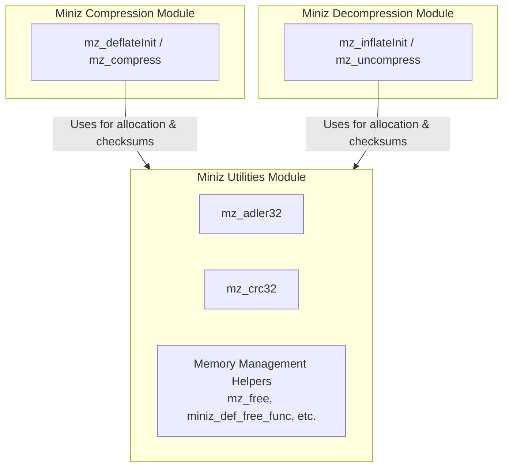
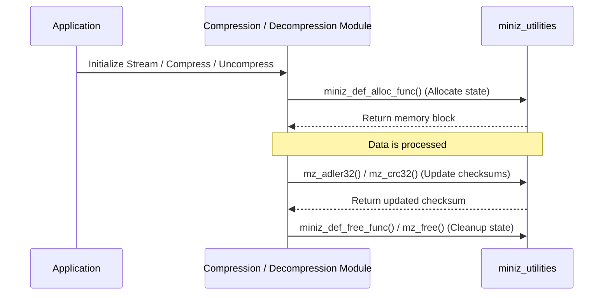

# Miniz Utilities Module Documentation

## Introduction

The `miniz_utilities` module provides fundamental helper utilities and common support functions required across the `miniz` library. It includes checksum algorithms (Adler-32 and CRC-32), memory management wrappers (`mz_free`, `miniz_def_free_func`, allocation/reallocation functions), and version reporting. These utilities are heavily relied upon by both the [miniz_compression](miniz_compression.md) and [miniz_decompression](miniz_decompression.md) modules.

---

## Core Components

The module exposes the following core functions from `miniz.c`:

1. **`mz_adler32`**
   - **Purpose:** Computes the Adler-32 checksum of a data buffer.
   - **Signature:** `mz_ulong mz_adler32(mz_ulong adler, const unsigned char *ptr, size_t buf_len)`

2. **`mz_crc32`**
   - **Purpose:** Computes the CRC-32 checksum of a data buffer using optimized lookup tables (or external implementations if configured).
   - **Signature:** `mz_ulong mz_crc32(mz_ulong crc, const mz_uint8 *ptr, size_t buf_len)`

3. **`mz_free` & Default Allocators**
   - **Purpose:** Provide standard memory management wrappers (`mz_free`, `miniz_def_alloc_func`, `miniz_def_free_func`, `miniz_def_realloc_func`) used by zlib-style compression and decompression streams.
   - **Signatures:**
     - `void mz_free(void *p)`
     - `void *miniz_def_alloc_func(void *opaque, size_t items, size_t size)`
     - `void miniz_def_free_func(void *opaque, void *address)`
     - `void *miniz_def_realloc_func(void *opaque, void *address, size_t items, size_t size)`

---

## Architecture and Component Relationships

The `miniz_utilities` module acts as a foundational utility layer supporting stream initialization, checksum verification, and memory allocation across compression and decompression operations.

---

## Data Flow and Component Interaction

When client applications initialize streams or perform compression/decompression via [miniz_compression](miniz_compression.md) or [miniz_decompression](miniz_decompression.md), the `miniz_utilities` module is invoked for memory management setup and stream checksum updates.

---

## References

- [miniz_compression](miniz_compression.md)
- [miniz_decompression](miniz_decompression.md)
