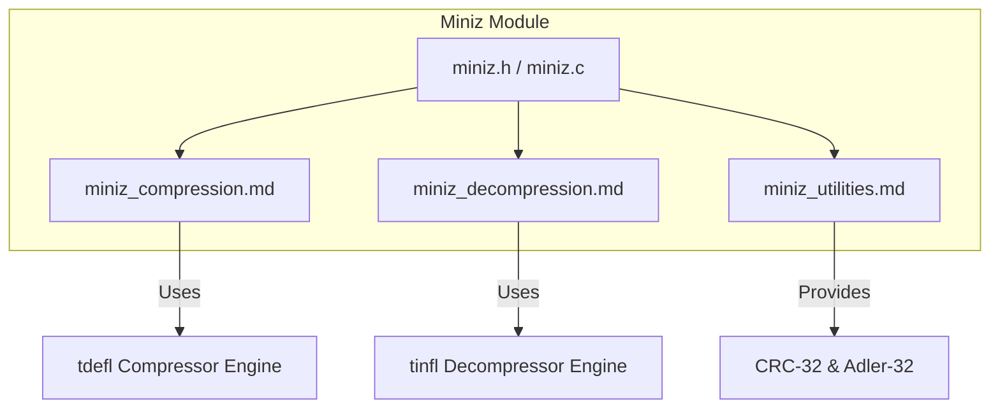
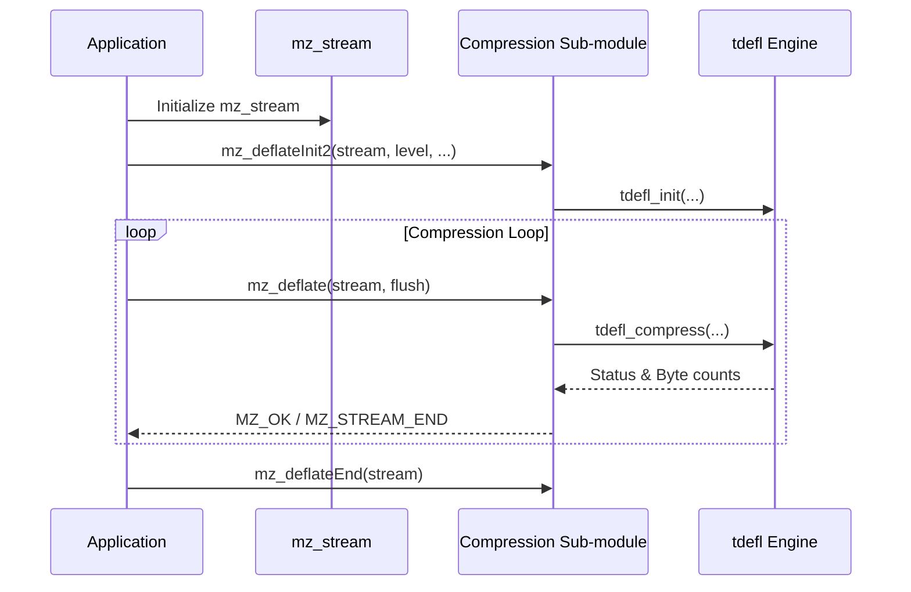

# Miniz Module Documentation

## Overview

The `miniz` module provides a comprehensive, lightweight, public-domain implementation of DEFLATE compression/decompression, a zlib-compatible C API subset, and support for checksum algorithms (`CRC-32` and `Adler-32`). It serves as a drop-in replacement for standard `zlib` in many applications while maintaining a minimal CPU cache footprint and dependency-free operation.

---

## Architecture & Sub-modules

The module is structured around zlib-compatible streaming interfaces, single-call helper functions, and robust checksum utilities. It delegates core low-level compression and decompression algorithms to internal engines (`tdefl` and `tinfl`) while wrapping them in standard `mz_stream` abstractions.

### Sub-Modules

1. **[Compression Sub-module](miniz_compression.md)**:
   - Manages zlib-style compression streams (`mz_stream`), initialization (`mz_deflateInit`, `mz_deflateInit2`), streaming deflation (`mz_deflate`), buffer bounding (`mz_deflateBound`, `mz_compressBound`), and single-call compression (`mz_compress`, `mz_compress2`).
2. **[Decompression Sub-module](miniz_decompression.md)**:
   - Manages inflation state (`inflate_state`), stream initialization (`mz_inflateInit`, `mz_inflateInit2`), streaming inflation (`mz_inflate`), resetting (`mz_inflateReset`), and single-call decompression (`mz_uncompress`, `mz_uncompress2`).
3. **[Utilities Sub-module](miniz_utilities.md)**:
   - Provides optimized checksum routines (`mz_crc32`, `mz_adler32`), memory allocation defaults (`miniz_def_alloc_func`, `miniz_def_free_func`, `miniz_def_realloc_func`), error formatting (`mz_error`), and version queries (`mz_version`).

---

## Component Relationship & Data Flow

When applications perform compression or decompression operations, they interact via the `mz_stream` struct. Below is the interaction sequence for standard stream compression:

---

## Usage Notes & Compatibility

- **Zlib Compatibility**: Unless `MINIZ_NO_ZLIB_COMPATIBLE_NAMES` is defined, `miniz` maps zlib types (`z_stream`, `Bytef`, `uLong`) and functions (`deflate`, `inflate`, `compress`, `uncompress`, `crc32`, `adler32`) directly to their `mz_*` equivalents.
- **Error Handling**: Functions return standard zlib return codes such as `MZ_OK`, `MZ_STREAM_END`, `MZ_DATA_ERROR`, `MZ_MEM_ERROR`, `MZ_BUF_ERROR`, and `MZ_PARAM_ERROR`. Use `mz_error()` (or `zError()`) to retrieve human-readable error descriptions.
