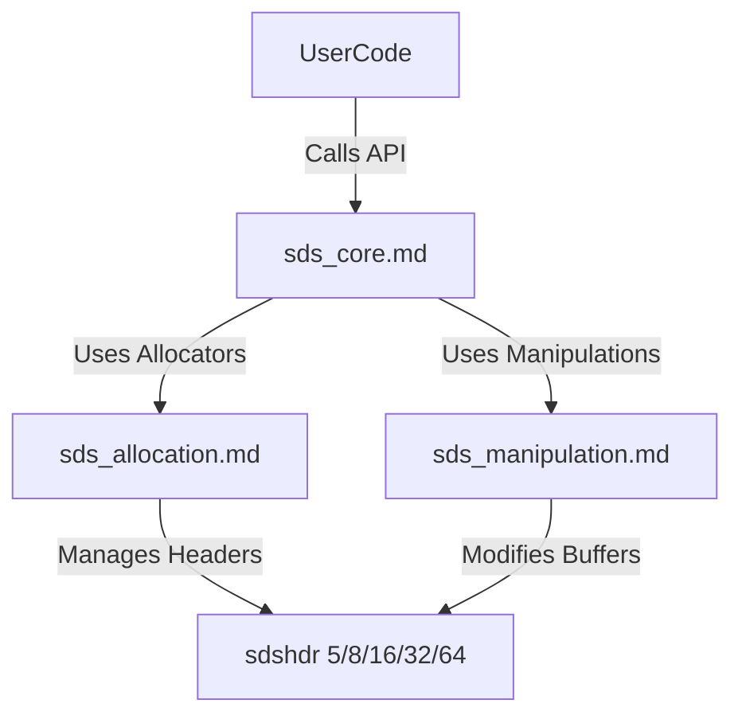
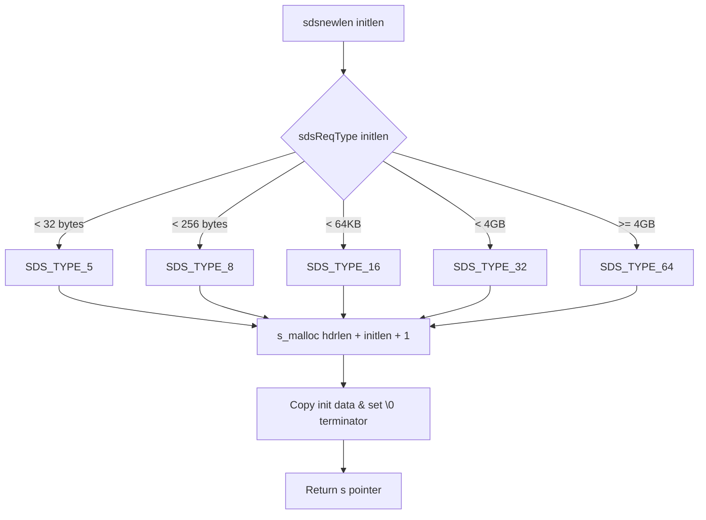

# SDS (Simple Dynamic Strings) Module Documentation

## Introduction and Purpose

The **SDS (Simple Dynamic Strings)** module (`sds.c`, `sds.h`) provides a C dynamic strings library (SDSLib 2.0) designed to extend standard C-style strings with binary safety, constant-time length retrieval ($O(1)$), and memory-efficient header structures. 

Key objectives and features of SDS include:
- **Binary Safety**: SDS strings store length explicitly rather than relying on null terminators (`\0`), allowing arbitrary binary data (including embedded `\0` bytes) to be safely stored and manipulated.
- **C Compatibility**: SDS strings are binary-compatible with standard C strings; every SDS pointer points directly to the string payload following a binary header, permitting direct use with standard library functions like `printf()`.
- **Memory Optimization**: Employs multiple packed header types (`sdshdr5`, `sdshdr8`, `sdshdr16`, `sdshdr32`, `sdshdr64`) based on string length to minimize memory overhead.
- **Preallocation Strategy**: Features amortized reallocation policies (`SDS_MAX_PREALLOC`) to reduce the frequency of costly memory reallocations during append operations.

---

## Architecture Overview

An SDS string is represented by the `sds` type, which is simply a pointer to the character array payload (`char *`). Immediately preceding the pointer in memory lies a packed header structure containing metadata such as string length, allocated capacity, and type flags.

```
+-------------------+----------------+------------------+
| SDS Header        | String Payload | Null Terminator  |
| (sdshdr8/16/32/64)| (buf[])        | ('\0')           |
+-------------------+----------------+------------------+
^                   ^
|                   |
sh (header pointer) s (sds string pointer, passed around in API)
```

### Core Components & Sub-modules

Since `sds` is a compact, cohesive library with a single core source file and header, we organize its functionality into logical sub-modules:
1. **[sds_core](sds_core.md)**: Header definitions, string lifecycle management (`sdsnew`, `sdsfree`, `sdsdup`), and low-level metadata accessors (`sdslen`, `sdsavail`, `sdsalloc`).
2. **[sds_allocation](sds_allocation.md)**: Memory allocation, growth, preallocation, and shrinking logic (`sdsMakeRoomFor`, `sdsRemoveFreeSpace`, `sdsgrowzero`, `sdsIncrLen`).
3. **[sds_manipulation](sds_manipulation.md)**: Concatenation, copying, formatting (`sdscatfmt`, `sdscatprintf`), trimming, case conversion, splitting, joining, and escaping (`sdscatrepr`, `sdssplitargs`).

---

## Architecture Diagrams

### Component Dependency & Interaction



### Memory Layout & Header Selection Flow



---

## Sub-Modules Reference

- **[sds_core](sds_core.md)**: Covers core type definitions, header structs (`sdshdr5`, `sdshdr8`, `sdshdr16`, `sdshdr32`, `sdshdr64`), initialization, destruction, duplication, and inline metadata queries.
- **[sds_allocation](sds_allocation.md)**: Details buffer management functions such as `sdsMakeRoomFor`, `sdsRemoveFreeSpace`, `sdsgrowzero`, and `sdsIncrLen`.
- **[sds_manipulation](sds_manipulation.md)**: Details string modification utilities including `sdscat`, `sdscpy`, `sdscatfmt`, `sdstrim`, `sdsrange`, `sdssplitlen`, `sdssplitargs`, and `sdscatrepr`.
