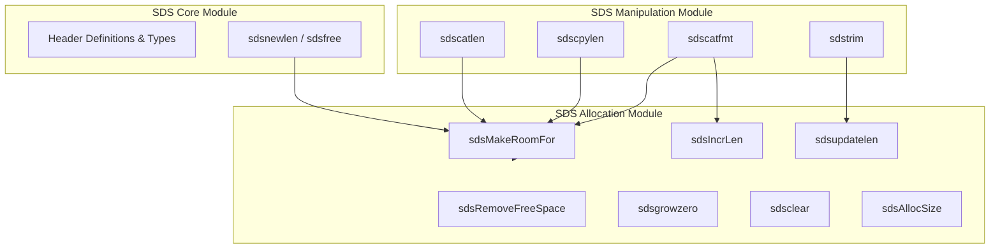

# SDS Allocation Module Documentation

## 1. Introduction

The **sds_allocation** module is a core part of the SDS (Simple Dynamic Strings) library, responsible for dynamic memory management, buffer growth strategies, reallocation, length updates, and capacity optimization of SDS strings. 

While the [sds_core](sds_core.md) module handles basic string creation, header management, and core type definitions, and the [sds_manipulation](sds_manipulation.md) module provides string operations (concatenation, splitting, trimming, formatting), the **sds_allocation** module acts as the underlying engine that ensures efficient memory allocation, buffer enlargement (`sdsMakeRoomFor`), trimming (`sdsRemoveFreeSpace`), and length tracking (`sdsIncrLen`, `sdsclear`, `sdsupdatelen`).

---

## 2. Architecture and Core Components

The allocation module manages the underlying heap buffers attached to SDS headers (`sdshdr8`, `sdshdr16`, `sdshdr32`, `sdshdr64`). Because SDS strings store metadata (length, allocation size, and type flags) immediately preceding the string pointer, memory reallocations or header type promotions require careful pointer arithmetic and buffer copying.

### Core Functions

- **`sdsMakeRoomFor(sds s, size_t addlen)`**: Ensures there is enough free space at the end of the SDS string to append `addlen` additional bytes plus a null terminator. Implements preallocation heuristics (doubling capacity below `SDS_MAX_PREALLOC`, adding fixed increments above) and handles header type promotions if required.
- **`sdsRemoveFreeSpace(sds s)`**: Reallocates the SDS string to remove all unused trailing free space, potentially demoting the header type to minimize memory footprint.
- **`sdsgrowzero(sds s, size_t len)`**: Enlarges the SDS string to the specified length, zero-initializing any newly added bytes.
- **`sdsIncrLen(sds s, ssize_t incr)`**: Adjusts the logical length of the string by `incr` (positive or negative) without triggering reallocations, updating the internal header length and ensuring null-termination. Useful for direct I/O operations (e.g., reading from a file descriptor directly into the SDS buffer).
- **`sdsAllocSize(sds s)`**: Calculates the total memory allocation size of an SDS string, including the header, string content, free space, and null terminator.
- **`sdsclear(sds s)`**: Resets the logical length of the string to `0` while preserving the allocated buffer capacity for future appends.
- **`sdsupdatelen(sds s)`**: Recalculates and updates the logical length of the string using `strlen(s)`, useful when the string has been modified manually in-place.

---

## 3. Component Relationships and Module Fit

The **sds_allocation** module sits strictly between basic core primitives and high-level string manipulation functions.



---

## 4. Data Flow & Allocation Strategies

### Buffer Enlargement and Preallocation (`sdsMakeRoomFor`)

When appending data to an SDS string, `sdsMakeRoomFor` checks the available free space (`sdsavail(s)`). If the requested additional length exceeds available space, it recalculates the required capacity using Redis's preallocation strategy:

```mermaid
sequenceDiagram
    participant Client as Caller / Manipulation Module
    participant Alloc as sdsMakeRoomFor
    participant Heap as Memory Allocator (s_malloc / s_realloc)

    Client->>Alloc: sdsMakeRoomFor(s, addlen)
    Alloc->>Alloc: Check avail >= addlen?
    alt Sufficient Space
        Alloc-->>Client: Return original pointer s
    else Insufficient Space
        Alloc->>Alloc: Calculate newlen = (len + addlen) * 2 (or + SDS_MAX_PREALLOC)
        Alloc->>Alloc: Determine required header type (SDS_TYPE_8/16/32/64)
        alt Header Type Unchanged
            Alloc->>Heap: s_realloc(sh, hdrlen + newlen + 1)
            Heap-->>Alloc: newsh pointer
        else Header Type Upgraded
            Alloc->>Heap: s_malloc(hdrlen + newlen + 1)
            Heap-->>Alloc: newsh pointer
            Note over Alloc: Copy existing string to new header location<br/>Free old header buffer (`s_free`)
        end
        Alloc->>Alloc: Update allocation size & header flags
        Alloc-->>Client: Return new s pointer
    end
end
```

### Direct I/O Optimization (`sdsIncrLen`)
`sdsIncrLen` enables zero-copy style appends from system calls like `read(2)`:

```c
size_t oldlen = sdslen(s);
s = sdsMakeRoomFor(s, BUFFER_SIZE);
ssize_t nread = read(fd, s + oldlen, BUFFER_SIZE);
if (nread > 0) {
    sdsIncrLen(s, nread);
}
```
This bypasses intermediate user-space copy buffers by writing directly into the preallocated SDS buffer space and subsequently updating the length via `sdsIncrLen`.
