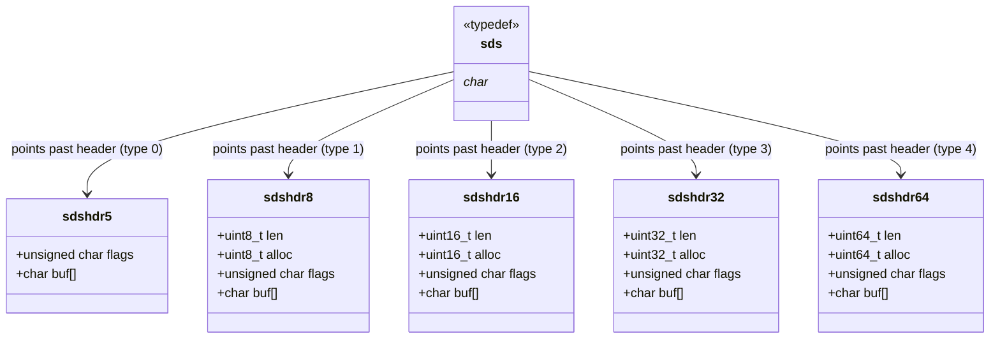
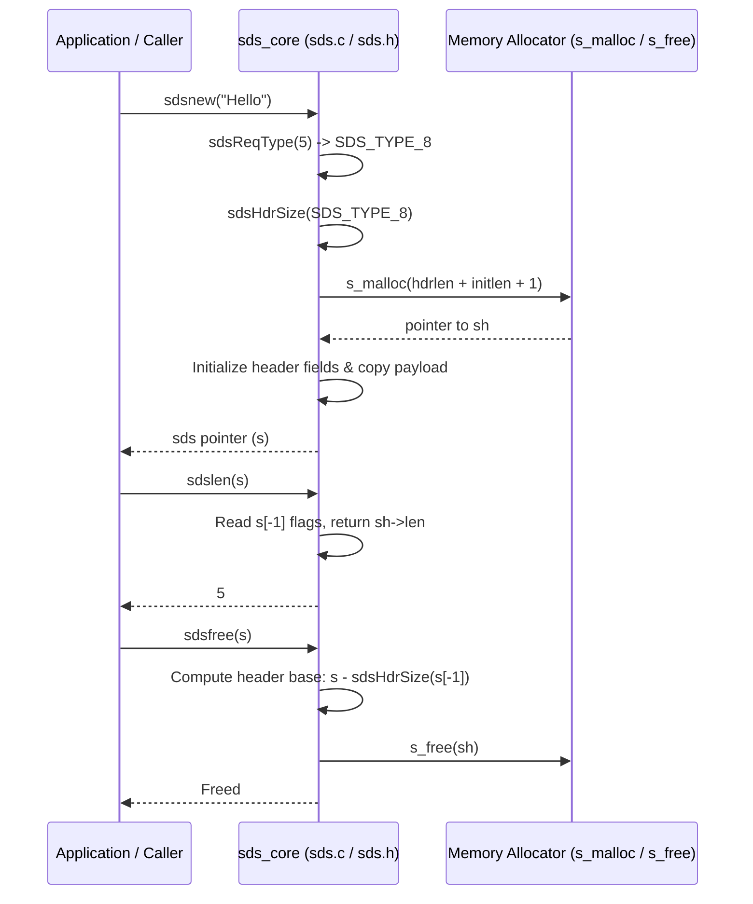

# SDS Core Module (`sds_core`) Documentation

## Introduction

The **`sds_core`** module forms the foundation of SDSLib (Simple Dynamic Strings Library Version 2.0). It defines the fundamental data structures, memory layouts, core lifecycle management functions, and low-level inline utilities for binary-safe dynamic strings in C. Designed initially for Redis, SDS strings solve the typical pitfalls of standard C strings (`char*`) by storing metadata (such as string length and allocated capacity) adjacent to the string buffer while remaining binary-safe and 100% compatible with standard C string APIs.

---

## Architecture and Component Relationships

### SDS Header Types
To optimize memory usage across strings of drastically different sizes, SDSLib 2.0 defines five distinct header types (`sdshdr5` through `sdshdr64`). Each header packs metadata immediately preceding the string buffer (`sds`), allowing a pointer to an SDS string to be seamlessly cast backwards to access its header.



### Memory Layout & Pointer Arithmetic
An `sds` string pointer points directly to the first character of the string payload (`buf[]`). The single byte immediately preceding `s` (`s[-1]`) stores the `flags` byte, where the 3 least significant bits determine the SDS header type and (in type 5) the upper bits store the length.

```
+----------------+----------------+------------------+----------------+
| Header Fields  | Flags (s[-1])  | String Payload   | Null Terminator|
| (len, alloc)   | (Type bits)    | (s[0] ... s[len])| ('\0')         |
+----------------+----------------+------------------+----------------+
^                                 ^
|                                 |
+-- `sh` (Header Base)            +-- `s` (SDS String Pointer)
```

---

## Core Components

### 1. Data Structures (`sds.h`)
- **`sdshdr5`**: Optimized for small strings up to 31 bytes. Stores length directly in the upper 5 bits of the `flags` byte (no allocation tracking).
- **`sdshdr8`**: Uses 8-bit integers (`uint8_t`) for `len` and `alloc`, supporting strings up to 255 bytes.
- **`sdshdr16`**: Uses 16-bit integers (`uint16_t`), supporting strings up to 65,535 bytes.
- **`sdshdr32`**: Uses 32-bit integers (`uint32_t`), supporting strings up to 4 GB.
- **`sdshdr64`**: Uses 64-bit integers (`uint64_t`), supporting extremely large strings.

### 2. Inline Accessors & Mutators (`sds.h`)
- **`sdslen(const sds s)`**: Inspects `s[-1]` and returns the logical length of the string based on its header type.
- **`sdsavail(const sds s)`**: Computes available free space (`alloc - len`) for appending without reallocation.
- **`sdsalloc(const sds s)`**: Returns total allocated capacity excluding the header and null terminator.
- **`sdssetlen(sds s, size_t newlen)` / `sdsinclen(sds s, size_t inc)`**: Updates or increments the string's logical length.
- **`sdssetalloc(sds s, size_t newlen)`**: Sets the allocated capacity field in the header.

### 3. Lifecycle Management (`sds.c` & `sds.h`)
- **`sdsReqType(size_t string_size)`**: Determines the smallest appropriate SDS header type for a given size.
- **`sdsHdrSize(char type)`**: Returns the byte size of the header structure corresponding to a given SDS type.
- **`sdsnewlen(const void *init, size_t initlen)`**: Allocates and initializes a new SDS string of length `initlen` with optional initial data or `SDS_NOINIT`.
- **`sdsnew(const char *init)`**: Creates an SDS string from a null-terminated C string.
- **`sdsempty(void)`**: Creates a zero-length SDS string using type 8 (optimized for subsequent appends).
- **`sdsdup(const sds s)`**: Duplicates an existing SDS string.
- **`sdsfree(sds s)`**: Frees the entire memory block (header, buffer, and null terminator) associated with an SDS string.
- **`sds_free(void *ptr)`**: Exposes the underlying allocator free wrapper to linked applications.

---

## Data Flow & Lifecycle Interaction

The diagram below illustrates how strings are requested, created, queried, and freed within `sds_core`:



---

## Related Modules

- **[sds_allocation](sds_allocation.md)**: Depends on `sds_core` primitives (`sdsavail`, `sdslen`, `sdsHdrSize`, `sdsReqType`) to manage buffer growth, reallocation (`sdsMakeRoomFor`), space reduction (`sdsRemoveFreeSpace`), and length updates.
- **[sds_manipulation](sds_manipulation.md)**: Utilizes `sds_core` headers, length accessors, and allocation routines to perform concatenation, copying, formatting, trimming, searching, and splitting operations.
