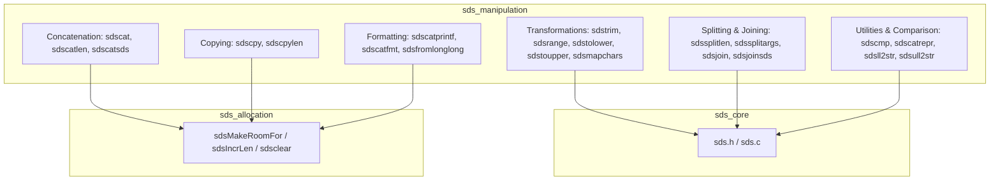
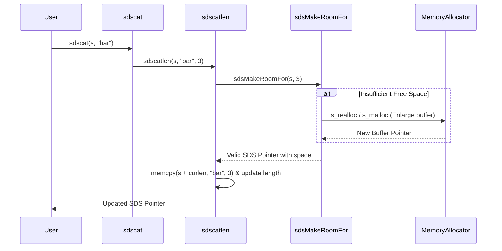

# SDS Manipulation Module Documentation

## Introduction

The **sds_manipulation** module provides a comprehensive set of functions for modifying, querying, formatting, parsing, and transforming Simple Dynamic Strings (SDS). Building directly on top of the underlying memory management and core data structures defined in the `sds_core` and `sds_allocation` modules, this module provides rich string manipulation capabilities similar to high-level language string libraries while retaining C's performance and binary safety.

---

## Architecture and Component Relationships

The module operates on SDS pointers (`sds`), which point directly to the string payload while leveraging the preceding header metadata (such as length and flags) managed by `sds_core` and `sds_allocation`.

---

## Core Components

### 1. Concatenation and Copying
- **`sdscatlen`**: Appends a binary-safe buffer of specified length to an SDS string.
- **`sdscat`**: Appends a null-terminated C string to an SDS string.
- **`sdscatsds`**: Appends one SDS string to another.
- **`sdscpylen`**: Overwrites an SDS string with a binary-safe buffer of specified length.
- **`sdscpy`**: Overwrites an SDS string with a null-terminated C string.

### 2. Numeric Conversion and Formatting
- **`sdsll2str` / `sdsull2str`**: High-performance helpers converting signed/unsigned 64-bit integers to string representations.
- **`sdsfromlonglong`**: Creates a new SDS string from a `long long` value.
- **`sdscatvprintf`**: Appends formatted output using a `va_list`.
- **`sdscatprintf`**: Variadic function appending printf-formatted output.
- **`sdscatfmt`**: High-performance custom formatter supporting an optimized subset of format specifiers (`%s`, `%S`, `%i`, `%I`, `%u`, `%U`, `%%`) without standard `libc` formatting bottlenecks.

### 3. Transformation, Trimming, and Slicing
- **`sdstrim`**: Removes leading and trailing characters matching any character in a specified set.
- **`sdsrange`**: In-place substring extraction supporting inclusive start/end indices and negative indexing.
- **`sdstolower` / `sdstoupper`**: Case conversion functions applied in-place.
- **`sdsmapchars`**: Replaces specific characters in an SDS string with mapped counterparts.

### 4. Comparison, Representation, and Splitting/Joining
- **`sdscmp`**: Binary-safe comparison of two SDS strings.
- **`sdscatrepr`**: Appends an escaped representation of non-printable/binary characters.
- **`sdssplitlen`**: Splits a binary-safe string by a separator into an array of SDS tokens.
- **`sdsfreesplitres`**: Frees split result arrays.
- **`sdssplitargs`**: Parses a line into argument tokens supporting REPL-style quotes and escape codes.
- **`sdsjoin` / `sdsjoinsds`**: Joins arrays of C or SDS strings using a delimiter.

---

## Data Flow & Process Diagrams

### Example: Concatenation Data Flow (`sdscat`)

---

## Related Modules

- **[sds_core](sds_core.md)**: Manages core header definitions (`sdshdr5` through `sdshdr64`), length queries (`sdslen`), and availability checks (`sdsavail`).
- **[sds_allocation](sds_allocation.md)**: Provides memory management functions such as `sdsMakeRoomFor`, `sdsRemoveFreeSpace`, `sdsclear`, and `sdsIncrLen`.
