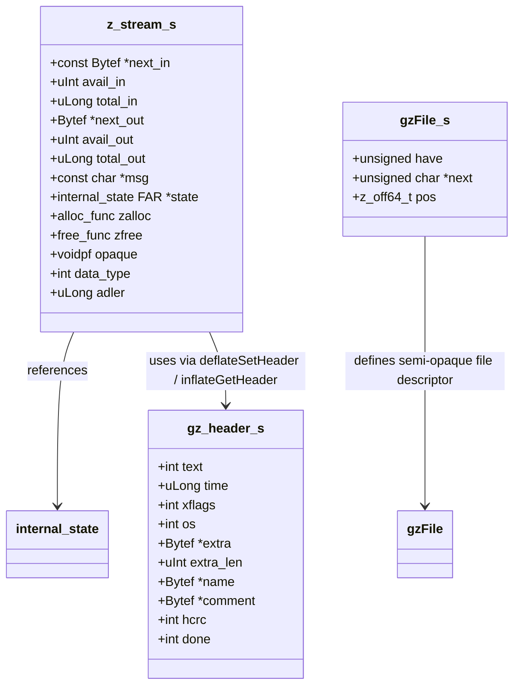
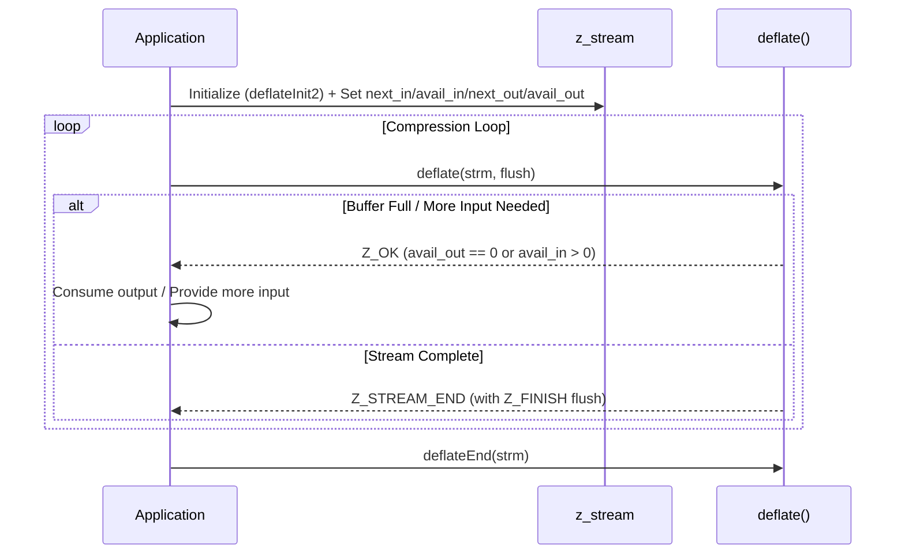
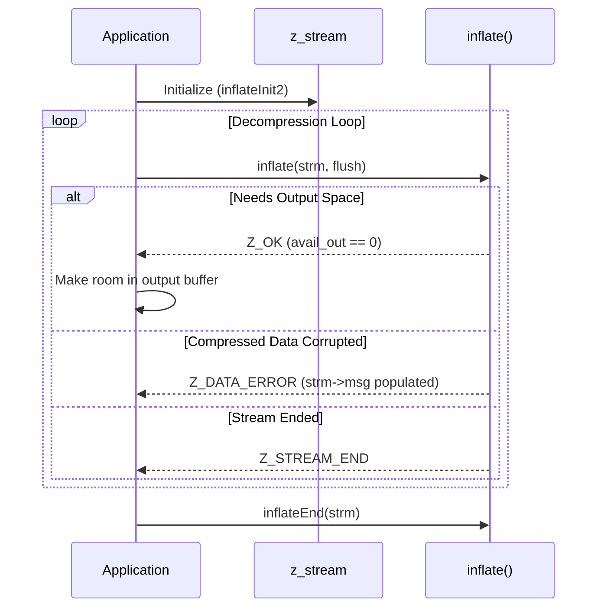

# Zlib Module Documentation

## Introduction

The `zlib` module (`zlib.h`) is the primary public interface of the **zlib** general-purpose compression library (version 1.3.2). It provides robust in-memory compression and decompression services adhering to RFCs 1950 (zlib format), 1951 (deflate format), and 1952 (gzip format). Additionally, it offers a `stdio`-like interface for compressed file I/O (`gz*` functions) and high-performance checksum utilities (`adler32` and `crc32`).

---

## Architecture & Component Relationships

The zlib library architecture revolves around stream-based processing (`z_stream`), file abstraction descriptors (`gzFile`), and modularized algorithms (deflate/inflate).

### Core Data Structures

---

## Component Details & API Categories

### 1. Basic Compression & Decompression Streams
Stream-oriented APIs allow incremental processing where applications feed input buffers and drain output buffers iteratively.
* **Initialization**: `deflateInit`, `deflateInit2`, `inflateInit`, `inflateInit2`
* **Execution**: `deflate`, `inflate`
* **Termination**: `deflateEnd`, `inflateEnd`
* **Reset & Tuning**: `deflateReset`, `inflateReset`, `deflateParams`, `deflateTune`

### 2. Simple In-Memory Utility Functions
Convenience wrappers for one-shot compression and decompression:
* **Compress**: `compress`, `compress2`, `compressBound` (along with `_z` variants)
* **Uncompress**: `uncompress`, `uncompress2` (along with `_z` variants)

### 3. Gzip File Access (`gz*` interface)
A `stdio`-compatible layer for reading, writing, and seeking through gzip compressed files:
* **Opening/Closing**: `gzopen`, `gzdopen`, `gzclose`, `gzclose_r`, `gzclose_w`
* **I/O Operations**: `gzread`, `gzfwrite`, `gzwrite`, `gzgets`, `gzputs`, `gzgetc`, `gzputc`, `gzungetc`, `gzprintf`
* **Navigation & State**: `gzseek`, `gztell`, `gzoffset`, `gzrewind`, `gzeof`, `gzflush`, `gzdirect`, `gzerror`, `gzclearerr`

### 4. Checksum Utilities
Independent data integrity check algorithms:
* `adler32`, `adler32_z`, `adler32_combine`
* `crc32`, `crc32_z`, `crc32_combine`, `crc32_combine_gen`, `crc32_combine_op`

---

## Data Flow & Control Flow

### Compression Data Flow

### Decompression & Header Processing Flow

---

## Error Handling & Return Codes

Zlib functions return standard integer status codes:
* **`Z_OK` (0)**: Success or progress made.
* **`Z_STREAM_END` (1)**: End of compressed data stream reached successfully.
* **`Z_NEED_DICT` (2)**: Preset dictionary required to continue.
* **`Z_ERRNO` (-1)**: File system / OS error (consult `errno`).
* **`Z_STREAM_ERROR` (-2)**: Inconsistent stream state or invalid parameter.
* **`Z_DATA_ERROR` (-3)**: Input data corruption or format violation.
* **`Z_MEM_ERROR` (-4)**: Memory allocation failure.
* **`Z_BUF_ERROR` (-5)**: Non-fatal buffer error (e.g., zero progress possible, output buffer full).
* **`Z_VERSION_ERROR` (-6)**: Library version mismatch.
